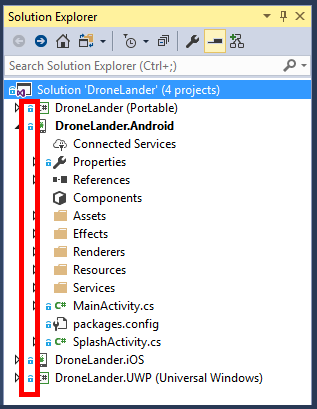
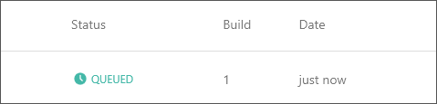

<a name="HOLTitle"></a>
# Operation Remote Resupply, Part 3 #

---

<a name="Overview"></a>
## Overview ##

One of the key challenges to maintaining and supporting mobile apps is understanding what users encounter once an app is published. No matter how perfectly you write your code, or how thorough you are about exception handling and logging, apps sometimes misbehave or even crash. When they do, you need to know what went wrong and why. [Visual Studio Mobile Center](https://www.visualstudio.com/vs/mobile-center/ "Visual Studio Mobile Center") lets you collect crash data — including full stack traces — from various devices so you can identify bugs and prioritize fixes.

Beyond crash analytics, you may want statistics regarding how many users are launching your app, where they are located, and what languages they speak. Visual Studio Mobile Center makes it easy to collect this information and more. It even allows you to collect rich behavioral analytics and answer questions such as which features are used most often, which screens are never seen, and how users utilize in-app purchases.  

Visual Studio Mobile Center can also be used to automate the build, test, and distribution process. In short, it packages essential services needed by mobile developers into a single, integrated product to help you control the development lifecycle from start to finish.

In this lab, you will use the Drone Lander app you built in previous labs to learn about the many features that Visual Studio Mobile Center has to offer, and why it should be part of the development process for every mobile app.

<a name="Objectives"></a>
### Objectives ###

In this lab, you will learn how to:

- Create a Visual Studio Mobile Center account
- Register an app with the Visual Studio Mobile Center
- Integrate the app build and distribution process with Visual Studio Mobile Center
- Add crash analytics to a Xamarin Forms app 
- View crash reports in Visual Studio Mobile Center

<a name="Prerequisites"></a>
### Prerequisites ###

The following are required to complete this lab:

- [Visual Studio Community 2017](https://www.visualstudio.com/vs/) or higher
- A computer running Windows 10 that supports hardware emulation using Hyper-V. For more information, and for a list of requirements, see https://msdn.microsoft.com/en-us/library/mt228280.aspx. 
- A GitHub account. If you don't have one, sign up for free at https://github.com/join.

If you wish to build and run the iOS version of the app, you also have to have a Mac running OS X 10.11 or higher, and both the Mac and the PC running Visual Studio 2017 require further configuration. For details, see https://developer.xamarin.com/guides/ios/getting_started/installation/windows/.

---

<a name="Exercises"></a>
## Exercises ##

This lab includes the following exercises:

- [Exercise 1: Register the app with Visual Studio Mobile Center](#Exercise1)
- [Exercise 2: Integrate the solution with a GitHub repository](#Exercise2)
- [Exercise 3: Integrate the app build cycle into Visual Studio Mobile Center](#Exercise3)
- [Exercise 4: Integrate app builds with Visual Studio Mobile Center Distribution](#Exercise4)
- [Exercise 5: Add crash analytics support to the app](#Exercise5)
- [Exercise 6 (optional): Review launch test results](#Exercise6)
 
Estimated time to complete this lab: **45** minutes.

<a name="Exercise1"></a>
## Exercise 1: Register the app with Visual Studio Mobile Center ##
 
Before you can use Visual Studio Mobile Center to automate the build and distribution process or retrieve crash analytics, you need to create a Visual Studio Mobile Center account and register the app there. In this exercise, you will create an account and then register the Android version of Drone Lander. Visual Studio Mobile Center doesn't curently support Windows apps, but Windows support is coming soon.

1. If you don't have a GitHub account, go to https://github.com/join and sign up for one.

1. In a browser, navigate to https://mobile.azure.com/login. Once there, click **Connect with GitHub**. If you are prompted to log in, do so using your GitHub account.
 
    

    _Connecting with a GitHub account_

1. On the "Authorize application" page, click **Authorize application**.

    

    _Authorizing a GitHub connection_

2. Enter a user name for your Visual Studio Mobile Center account (or accept the default) and click **Choose username**.  

    

    _Choosing a user name_

1. Now that you have created a Visual Studio Mobile Center account, the next step is to register the Drone Lander app that you built in Labs 1 and 2. To begin, click **Add new app**. 

    

    _Adding a new app in Visual Studio Mobile Center_

1. Enter "Drone Lander" for the app name, and specify **Android** as the OS and **Xamarin** as the platform. Then click **Add new app**. 

    

    _Register the Android version of Drone Lander_

1. Click **Xamarin.Forms** for a summary of the steps required to add the Mobile Center SDK to your app. (This is for informational purposes only at the moment. You will make these changes in the next exercise.)

    

    _Viewing Xamarin.Forms integration information_

If you would like to register the iOS of version Drone lander as well, you can do so by registering Drone Lander again, but this time specifying iOS as the operating system. You don't need to register the iOS version for this lab, but be aware that when you register a Xamarin app with Visual Studio Mobile Center, you need to register it separately for each platform that it runs on. 

<a name="Exercise2"></a>
## Exercise 2: Integrate the solution with a GitHub repository ##

To automate Visual Studio Mobile Center Build integration, you need to setup a remote source code repository. Mobile Center supports source code integration with GitHub, Bitbucket and Visual Studio Team Services (VSTS) repositories.

In this lab you will be using GitHub as your source repository. GitHub is a "Git" repository hosting service, that adds a number of additional features to the [Git](https://en.wikipedia.org/wiki/Git "Git") process. While Git is a command line tool, GitHub provides a Web-based graphical interface. GitHub also provides access control and collaboration features, such basic task management tools.

In this exercise you will be integrating your Drone Lander solution with a GitHub repository, to prepare it for Visual Studio Mobile Center build integration.

To integrate GitHub processes with Visual Studio 2017, you need the **GitHub extension for Visual Studio** installed. If you are unsure as to whether this extension is installed, you can check from within the Visual Studio IDE:

1. Type "github extension" into the Visual Studio 2017 "Quick Launch" to view available actions, and, if available, select **GitHub extension for Visual Studio** underneath the "Install" group. 

    

    _Accessing GitHub extension installation from the Quick Launch_

1. Once you have confirmed installation of GitHub integration, in Solution Explorer, right-click the **DroneLander** solution and use the **Add Solution to Source Control...** command to add the solution to a local GitHub repository. When successful, you will notice additional source code-related icons to the left of many of the items in Solution Explorer.

    

    _Visual icon representations after local GitHub integration_
 
1. In the Solution Explorer window, select the **GitHub** tab, then click **Get Started** to begin repository publishing steps.

    

    _Starting the GitHub publishing process_
 
1. Ensure you are logged into GitHub with the correct, active account, and click **Publish**.

    

    _Visual icon representations after local GitHub integration_
 
	After a short delay, a new DroneLander GitHub repo will be provisioned and available, and the Team Explorer "Home" tab will become available.

1. On the Team Explorer "Home" tab click **Sync**, and then click **Sync** one more time to synchronize GitHub incoming and outgoing commits.

    

    _Selecting Sync from the Home tab_ 

    

    _Synchronizing your GitHub repository_
 
	After another short delay a message with confirm a successful synchonization.

    

    _A successful GitHub synchronization_
 
Your Xamarin Forms solution has now been fully integrated with a GitHub repository and ready to be incorporated into a Visual Studio Mobile Center app build cycle.

<a name="Exercise3"></a>
## Exercise 3: Integrate the app build cycle into Visual Studio Mobile Center ##

With Visual Studio Mobile Center Build integration, you can manage your source code in a Git repository and create an installable app package automatically with every commit or push. Best of all, you don't need to provision any agents or external machines to build your apps. Mobile Center takes care of this and will compile your Android (and optionally iOS) apps right from the source code with no manual setup on your side.

In this exercise you will be integrating your Drone Lander solution with a GitHub repository, and configuring Visual Studio Mobile Center to integrate a build process with this repository.

1. Open your Visual Studio Mobile Center "apps collection" by opening [https://mobile.azure.com/apps](https://mobile.azure.com/apps "https://mobile.azure.com/apps") in a browser, and select the Android version of the **Drone Lander** app created in Exercise 1.

    

    _Selecting the Android version of Drone Lander in the apps collection_
 
1. Select the **Build** from the left portal navigation to view the Build integration page, then select **GitHub** in the "Select a service" menu.

    

    _Selecting the Android version of Drone Lander in the apps collection_ 

    

    _Connecting to the GitHub service_
 
	When Visual Studio Mobile Center detects the DroneLander repo setup in the previous exercise, the "Connect to repo" page will display a successful connection.   

1. Click the **DroneLander** repo in the list to view all GitHub branch information.

	
	
	_A successful GitHub Build cycle connection_ 

1. Select the **master** branch in the "Branches" list and then click **Setup a branch** to configure a branch for build integration.

	
	
	_Setting up a build branch_ 

1. Change the "Configuration" from Debug to **Release**.
1. Ensure **Build on push** and **Sign builds** in enabled, then click anywhere in the "Keystore file" panel to upload an Android Keystore file.

	
	
	_Configuring build branch settings_ 

1. Browse to import the file named **DroneLanderKeystore.keystore** from the lab's "Resources\Keystore" folder. A keystore file enables signing of the Android app package (*.apk) and is required for release deployment of Android apps.

	>The **DroneLanderKeystore.keystore** file was created in advance specifically for this lab. In your own development projects, you will want to create your own keystores in your environment using the Android Keystore tool available in Visual Studio 2017.

1. Enter the following values (without quotation marks) in the "Signing credentials" panel:
	- **KEYSTORE_PASSWORD** -> "DroneLander"
	- **KEY_ALIAS** -> "DroneLanderKeystore"
	- **KEY_PASSWORD** -> "DroneLander"
1. Enable both **Run a launch test on device** and **Distribute build** and click **Finish Setup**.

	After a short delay your first build will be successfully queued and ready to be built.

	
	
	_A queued app build in Visual Studio Mobile Center_ 

	After another short delay your first build will begin building.

	
	
	_An app beginning to build in Visual Studio Mobile Center_ 

	And when the build process is complete, you'll be able to easily move to the Distribute step, or even download the signed package directly, right from the build location, as well as view the entire build process log.

	
	
	_Your first successful build in Visual Studio Mobile Center_ 

1. Click **Download** -> **Download build** to verify you truly have a signed and verified Android *.apk file contained in a ZIP file, ready for use!

With your app build process fully integrated with Visual Studio Mobile Center, a new build process will automatically initiate every time you check in changes to your GitHub repo, making it easy to manage the both the build cycle, and more importantly, the distribution cycle. Would it be great if your new builds could be ready and users notified every time a new successful build was created? 

In the next exercise you will do just that, using Visual Studio Mobile Center Distribution.

<a name="Exercise4"></a>
## Exercise 4: Integrate app builds with Visual Studio Mobile Center Distribution ##

With your first successful build in place, it's time to get your app into the hand of some testers, via the Visual Studio Mobile Center Distribute feature. Distribution is managed via simple Distribution Groups containing a set of e-mails, and are designed to communicate with testers in a way they can directly install the app their phones or other devices, similar to the way they would download an app from the app store.   

In this exercise you will be using Visual Studio Mobile Center Distribution to notify one or more testers of the availability of an app release.

1. Open Visual Studio Mobile Center to the build created in the previous exercise, or open a browser and navigate to [https://mobile.azure.com/apps](https://mobile.azure.com/apps "https://mobile.azure.com/apps") to view your apps collection and return to the build result form the previous exercise, and click **Distribute**.

	
	
	_Selecting to distribute your app release_ 

1. Select the **Collaborators** distribution group, then click **Next >**. 

	
	
	_Setting up a build branch_ 

	>The Collaborators distribution group is created automatically when you configure build services in Visual Studio Mobile Center. You can create and manage additional groups as needed.

1. Optionally, enter content under **Release notes (optional)**, such as "My first release of the awesome Drone Lander app." and click **Distribute Build**.

	After a short delay, check your email at the email address used when you created your GitHub (and therefore Visual Studio Mobile Center) account, and you should have a simple, informative message from the Visual Studio Mobile Center notifying you of a new app release:

	
	
	_A new build notification from Visual Studio Mobile Center_ 

Feel free to add more testers to the Collaborators distribution group, or even create additional groups. Remember, users can install your app directly from their device by simply clicking on the link in the email.

Now that a few users have their hands on your app, it will be helpful to know if they've installed it, how its performing for them, and most especially if the app has defects or other issues you need to address. The is where Visual Studio Mobile Center Crash Analytics come to the rescue!

<a name="Exercise5"></a>
## Exercise 5: Add crash analytics support to the app ##

The Visual Studio Mobile Center SDK makes it easy to add logic to a Xamarin Forms app to generate crash analytics. In this exercise, you will add shared and platform-specific code to Drone Lander to configure it so that crash information can be viewed in Visual Studio Mobile Center, and you will test your changes by temporarily adding code that generates an unhandled exception when the app starts up. 

1. Open the **DroneLander** solution in Visual Studio 2017, if not already open from previous exercises.

1. In Solution Explorer, right-click the **DroneLander** solution and select **Manage NuGet Packages for Solution...**. 
1. Ensure that "Browse" is selected in the NuGet Package Manager, and type "Microsoft.Azure.Mobile.Analytics" into the search box. Select the **Microsoft.Azure.Mobile.Analytics** package. Then check the **Project** box to add the package to all of the projects in the solution, and click **Install**. When prompted to review changes, click **OK**. 
1. Return to the NuGet Package Manager and once more, ensure that "Browse" is selected. Type "Microsoft.Azure.Mobile.Crashes" into the search box and select the **Microsoft.Azure.Mobile.Crashes** package. Then check the **Project** box to add the package to all of the projects in the solution, and click **Install**. When prompted to review changes, click **OK**.
1. In Solution Explorer, open the **App.xaml.cs** file in the **DroneLander (Portable)** project. 
1. Add the following statements at the top of the file:

	```C#
	using Microsoft.Azure.Mobile;
	using Microsoft.Azure.Mobile.Analytics;
	using Microsoft.Azure.Mobile.Crashes;
	```

1. Add the following code to the ```OnStart``` method:

	```C#
	 MobileCenter.Start($"android={Common.MobileCenterConstants.AndroidAppId};" +
                   $"ios={Common.MobileCenterConstants.iOSAppId}",
                   typeof(Analytics), typeof(Crashes));

1. Open "CoreConstants.cs" in the **DroneLander (Portable)** **Common** folder, and add the following class directly below the ```CoreConstants``` class:

	```C#
	public static class MobileCenterConstants
    {
        public const string AndroidAppId = "[MOBILE_CENTER_ANDROID_APP_ID]";
        public const string iOSAppId = "";
    }
	```

	
	
	_Adding MobileCenterConstants class to CoreConstants.cs_ 

	These constants will be used by Mobile Center Crash and Analytics to track use and crash information when your app starts;

1. Return to the [Visual Studio Mobile Center app portal](https://mobile.azure.com/apps) in your browser and click the Android version of **Drone Lander**.
1. Click **Manage App** in the upper-right corner of the page. 
1. Copy the value in the **App secret** box to the clipboard.
1. Return to **CoreConstants.cs** and paste to replace the value of **AndroidAppId** with the value in your clipboard.
	 
	
	
	_The updated AndroidAppId in MobileCenterConstants_ 

1. Now it's time generate a crash report and see how it looks in Visual Studio Mobile Center. To do that, you will temporarily comment out a line of code in the app to generate a crash. Begin by opening the **MainViewModels.cs** in the **DroneLander (Portable)** **ViewModels** folder.
1. Locate the assignment of **this.ActiveLandingParameters** in the ```MainViewModel``` class initializer and comment it out.

	
	
	_Commenting out the active landing parameters_

	 Since we know a drone can't start a landing without active landing parameters, this is certain to throw an exception!

1. In Solution Explorer, right-click the **DroneLander.Android** project and select **Set as StartUp Project**. 
1. Click the **Run** button to launch Drone Lander in the selected Android emulator.
1. Confirm that shortly after the app loads in the emulator, an unhandled exception is thrown. 

	
	
	_Result of an unhandled exception_

1. Crash data is initially stored on the local device, and is typically transmitted to Visual Studio Mobile Center the next time the app loads. In Visual Studio, return to **MainViewModel.cs** and uncomment the line of code that generates the unhandled exception. 
1. Use Visual Studio's **Debug** > **Start Without Debugging** command (or simply press **CTRL+F5**) to launch the app **without** the debugger attached.  

	With the new crash and analytics features added to your app, it's probably a good time to commit your changes to your source repository.

1.  Right-click the **DroneLander** solution and use the **Commit** command to commit your recent changes to GitHub.
1. Enter a comment, such as "Added Mobile Center crash and analytics support." as the commit comment, then open "Commit All" drop down and select **Commit All and Push**.

	
	
	_Committing updates to GitHub_

1. Return to the [Visual Studio Mobile Center](https://mobile.azure.com/apps) in your browser and open **Drone Lander**.
1. Click **Crashes**.
1. Observe the various charts displaying crash information, as well as the entry at the bottom of the page representing the crash that you generated moments ago. 
1. Select the crash details for **Crash Group #1** at observe the through details, including the ability to view an entire stack trace.
 
    

    _Crash reporting in Visual Studio Mobile Center_

	>Note that the crash may not appear in the portal for 10 minutes or so. If it's not there, and you have a little time, proceed to optional Exercise 6 and return to the crash reports later. 

Having near real-time crash analytics available is important for any mobile app, but Visual Studio Mobile Center isn't limited to build integration, distribution, and crash reports. It also provides back-end services for authentication, integrated testing, data syncing, and (soon) push notifications, making it a one-stop solution for building mobile apps that you can maintain and scale. For more information, see https://docs.microsoft.com/en-us/mobile-center.

<a name="Exercise6"></a>
## Exercise 6 (optional): View launch test results ##

Have some extra time and want to check out an additional feature of Visual Studio Mobile Center?  You may have noticed in Exercise 3 you enabled "Run a launch test on device" when you configured your build settings, but you never really took a look at anything in the Test area of Visual Studio Mobile Center.

Even though you haven't configured any formal tests, yet, a "start up" test was run on the app since you enabled this setting.

1. Return to the [Visual Studio Mobile Center](https://mobile.azure.com/apps) in your browser and open **Drone Lander**.
1. Select **Test** from the left-navigation menu and observe an initial test was already run successfully.

    

    _The initial launch test results_
	
1. Click anywhere in the test panel to view a detail of the test results:

    

    _The initial launch test run details_
	 
1. Click the **App Launches Test** entry in the "TESTS" panel to view detailed information, including device model, hardware version, and even a screenshot of Drone Lander after initial startup!

    

    _Detailed launch run information, including a screenshot_	

This has been a short exercise, but probably enough to whet your imagination for what's coming up in a later lab focusing on testing, and integrating testing into the build and distribution process!

<a name="Summary"></a>
## Summary ##

Build, distribution, crash reporting, and analytics are now fully integrated into your development cycle, making it easy to simply write code, push changes to your source code repo, and let Visual Studio Mobile Center do all the heavy lifting. 

You also may have noticed Visual Studio Mobile Center Test features were available in the portal as well, and were perhaps wondering how to integrate testing into your build processes. Don't worry, you will be coming back to Visual Studio Mobile Center in Part 6, specifically to cover testing. 

That's it for Part 3 of Operation Remote Resupply. In Part 4, you will modify the app to integrate with an Azure Mobile backend, including integration of authentication, data services, and even creating your own mobile APIs.