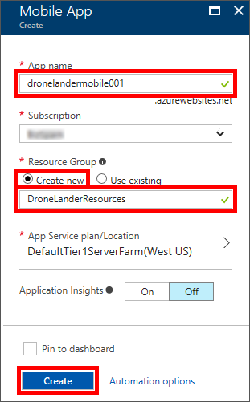
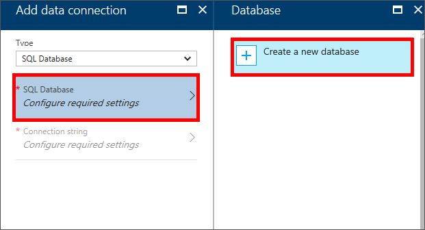
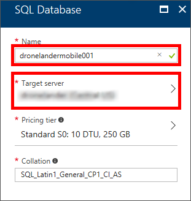
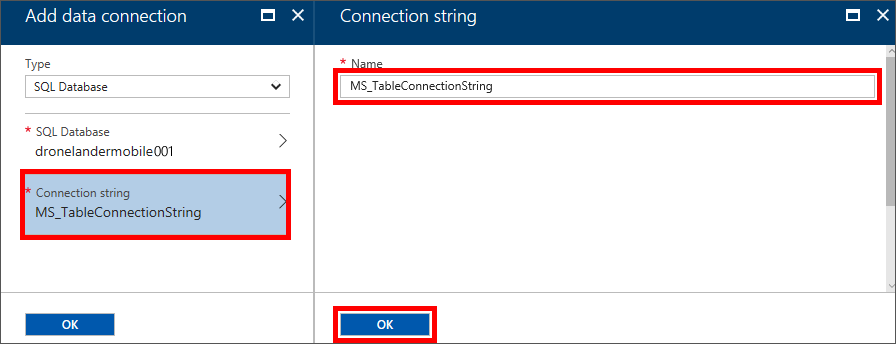
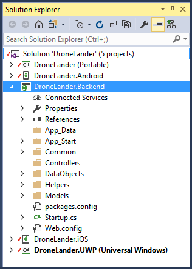
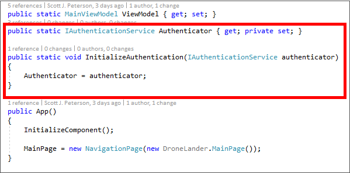
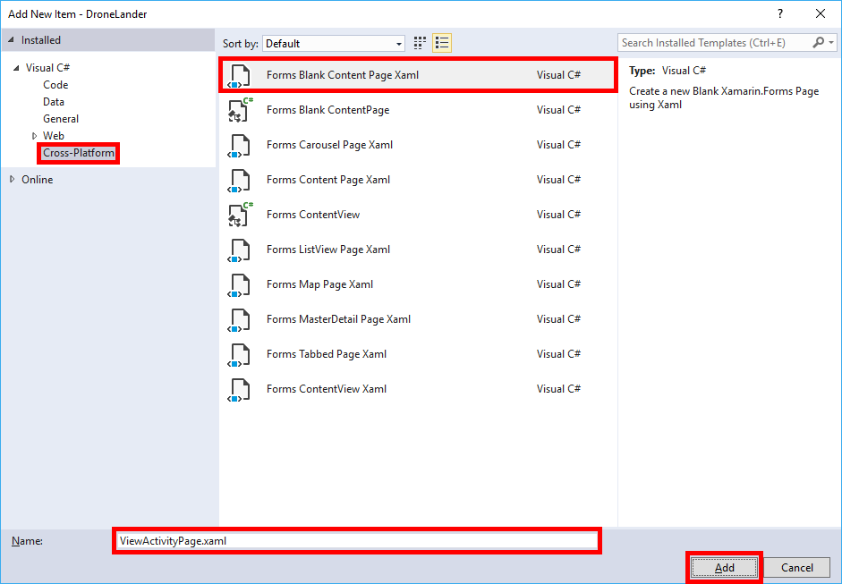

<a name="HOLTitle"></a>
# Operation Remote Resupply, Part 4 #

---

<a name="Overview"></a>
## Overview ##

The challenges of mobile development can often be daunting to even the most experienced developer. Mobile apps need to store data, and most users want their information available all the time, whether online or offline. Mobile apps need authentication and authorization to ensure the integrity and privacy of the data being sent, and modern mobile apps need an intuitive and reliable framework for real-time user notification and communication that can seamlessly broadcast information across a huge variety of platform variations and devices.

To meet these ever-increasing challenges, [Azure Mobile Apps](https://azure.microsoft.com/en-us/services/app-service/mobile/ "Azure Mobile Apps") offer a highly scalable, globally available mobile application development platform for developers that expose a rich set of capabilities such as authentication, authentication, data storage, and even offline synchronization and push notification.

In this lab, you will use Visual Studio 2017 and Azure Mobile App services to provision and configure a mobile backend service to provide an authenticated user sign in experience, as well as add features to your app to record drone landing attempt history and send real-time telemetry information to Mission Control.

<a name="Objectives"></a>
### Objectives ###

In this lab, you will learn how to:

- Create an Azure Mobile App
- Create an Azure Mobile backend service
- Add Mobile App authentication to a Xamarin Forms app
- Add Mobile App authentication to a backend service
- Call Mobile App backend services from a Xamarin Forms app

<a name="Prerequisites"></a>
### Prerequisites ###

The following are required to complete this lab:

- [Visual Studio Community 2017](https://www.visualstudio.com/vs/) or higher
- A computer running Windows 10 that supports hardware emulation using Hyper-V. For more information, and for a list of requirements, see https://msdn.microsoft.com/en-us/library/mt228280.aspx. 
- An active Microsoft Azure subscription. If you don't have one, [sign up for a free trial](http://aka.ms/WATK-FreeTrial)

If you wish to build and run the iOS version of the app, you also have to have a Mac running OS X 10.11 or higher, and both the Mac and the PC running Visual Studio 2017 require further configuration. For details, see https://developer.xamarin.com/guides/ios/getting_started/installation/windows/.

---

<a name="Exercises"></a>
## Exercises ##

This lab includes the following exercises:

- [Exercise 1: Create and configure an Azure Mobile App](#Exercise1)
- [Exercise 2: Add a data connection to an Azure Mobile App](#Exercise2)
- [Exercise 3: Create and publish Azure Mobile backend service](#Exercise3)
- [Exercise 4: Add Mobile App authentication to a backend service](#Exercise4)
- [Exercise 5: Add Mobile App authentication support to a Xamarin Forms app](#Exercise5)
- [Exercise 6: Call Mobile App services from a Xamarin Forms app](#Exercise6)
- [Exercise 7 (optional): Send telemetry to Mission Control](#Exercise7)
 
Estimated time to complete this lab: **45** minutes.

<a name="Exercise1"></a>
## Exercise 1: Create an Azure Mobile App ##
 
An Azure Mobile App is actually a "backend" service for a mobile app. You have already create the "client" side of a mobile app previous labs, using Xamarin Forms, and although Drone Lander is a complete, fully functioning app, there are no services available for storing data or authenticating users. An Azure Mobile App is a highly scalable, globally available mobile application development platform for mobile developers that delivers these features, with services such as data storage, authorization and authentication, and even offline storage and push notifications built right in.

In this exercise you will create an Azure Mobile App to serve as the foundation for your Drone Lander app backend. 

1. Open the [Azure Portal](https://portal.azure.com) in your browser. If asked to log in, do so using your Microsoft account.
1. Click **+ New**, followed by **Web + Mobile** and **Mobile App**.
1. Enter an app name that is unique within Azure, such as "dronelandermobile001". Under **Resource Group**, select **Create new** and enter "DroneLanderResourceGroup" as the resource-group name to create a resource group for the Function App. Accept the default values for all other parameters. Then click **Create** to create a new Mobile App.
    
	

    _Creating a new Azure Mobile App_

1. Click **Resource groups** in the ribbon on the left side of the portal, and then click **DroneLanderResourceGroup**. 
1. Wait until "Deploying" changes to "Succeeded," indicating that the Mobile App has been deployed.
 
That's it, it's that quick. Although you have a new Mobile App created, it doesn't do much yet, and is really more of a "placeholder" at the moment. In the next exercise you will be adding support for data storage services via Azure Mobile "Easy" table and API support.

<a name="Exercise2"></a>
## Exercise 2: Add a data connection to an Azure Mobile App ##

Every front end needs a great backend, and in mobile app development it’s important to have your data available at all times. Integrated with Azure Mobile Apps are the concepts of "Easy" tables and APIs, as well as direct data connections, that easy connect your mobile app backend services to data storage, as well as enable integrated authentication you will add later in this lab.

Azure Mobile data connections are "backended" by either Azure SQL Database or Azure Storage. In this exercise you will be configuring your Azure Mobile App to use Azure SQL Database.

1. Return to the Azure Mobile App, if not already opened from the previous exercise, and select **Data connections** from the "MOBILE" group.

	

    _Selecting Data connections in the Azure Mobile App_
 
1. Click **+ Add** to access the "Add data connection" panel.
1. Ensure **SQL database** is selected as the "Type" then select **Configure required settings** in the "SQL database" selection, and **+ Create new database** in the "Databases" panel.

	

    _Creating a new database in the Azure Mobile App_
 
1. Enter the value used for your Mobile App name, such as "dronelandermobile001" as the **Name** of your new database and click the **Target Server** panel.

	

    _Creating a new database in the Azure Mobile App_
 
	>Using the same name for your SQL database server and database is NOT required when configuring Mobile App database connections. The services can be named anything that makes sense for your situation in your organization. Use of the Mobile App name for SQL database name (and server) are for convenience only when working through this lab.

1. Click **+ Create a new server** in the "Server" panel and enter "dronelandermobile001" as the **Server name**, enter a **SQL admin login** of your own choosing, type in a **Password** and **Confirm password**, then select a **Location** nearest your current location and click **Select**.
1. After a short delay, the "New server" panel will collapse, and you will be returned to the "SQL Database" panel. Click **Select** in the "SQL Database" panel to be returned to the "Add data connection" panel. 
1. In the "Add data connection" click the **Connection string** selector, accept the default of "MS_TableConnectionString" then click **OK**.

	

    _Accepting the default "MS_TableConnectionString" value_
 
	>Since you will be working with a "Quick Start" backend service in the next exercise, it's important that you **use the default value of "MS_TableConnectionString" in this step**.

1. Click **OK** in the "Add data connection" panel to commit the changes you've made. Your SQL database connection, including a new Azure SQL database will now be provisioned and connected to your Azure Mobile App.
	
	Provisioning the server and database will take a few minutes. You can safely move on to the next step at any time.

Your Azure Mobile App data connection, including an Azure SQL database, have now been provisioned.

With a mobile service created, and a data connection provisioned and configured, all the pieces are now in place to start adding code to communicate between your Azure Mobile App and data storage. In the next exercise you will be creating the "plumbing" for these services and adding code for Azure Mobile App backend integration.

<a name="Exercise3"></a>
## Exercise 3: Create and publish Azure Mobile backend service ##

Although an Azure Mobile App is, in many ways, just a placeholder service, much of the complexity of working with backend services is handled for you, centrally, in the Azure Mobile App service itself, like managing connection strings and authentication providers. Allowing an Azure Mobile App to manage these tricky pieces has clear advantages, and allows a developer to focus primarily on writing code for business logic and features, instead of worrying about configuration and administration.

In this exercise you will be creating an Azure Mobile Backend using an Azure Mobile App "Quick Start" project you will add to your Drone Lander solution, and then writing code to take advantage of the built-in Mobile table and API features of Azure Mobile Apps.

1. In Visual Studio 2017, open the **DroneLander** solution, if not already open from previous the lab.
1. Right-click the **DroneLander** solution and use the **Add** > **Existing Project...** command to add **DroneLander.Backend.csproj** from the lab's "Resources\Quick Start\DroneLander.Backend" folder. This is the C# "Quick Start" project file for the Azure Mobile App backend you will be working with in this exercise.

	

    _The DroneLander solution with the addition of the Azure Mobile App backend project_

	>The Azure Mobile App Quick Start section provides a large number of additional Quick Start projects for various scenarios,  including Xamarin Forms, however many of the provided Quick Starts contain files, code, and configurations that are unnecessary for this lab. The Quick Start being used in this exercise has been tailored specifically to the services and logic used in the Drone Lander app.
 
1. Right-click the "Controllers" folder in the **DroneLander.Backend** project and use the **Add** > **Class** command to add a class file named "ActivityItemController.cs." Then replace the contents of the file with the following code:

	```C#
	using System.Linq;
	using System.Threading.Tasks;
	using System.Web.Http;
	using System.Web.Http.Controllers;
	using System.Web.Http.OData;
	using Microsoft.Azure.Mobile.Server;
	using DroneLander.Service.Models;
	using DroneLander.Service.DataObjects;
	
	namespace DroneLander.Service.Controllers
	{
	    public class ActivityItemController : TableController<ActivityItem>
	    {
	        protected override void Initialize(HttpControllerContext controllerContext)
	        {
	            base.Initialize(controllerContext);
	            DroneLanderServiceContext context = new DroneLanderServiceContext();
	            DomainManager = new EntityDomainManager<ActivityItem>(context, Request);
	        }
	
	        // GET tables/ActivityItem
	        public IQueryable<ActivityItem> GetAllActivityItems()
	        {
	            return Query();
	        }
	
	        // GET tables/ActivityItem/48D68C86-6EA6-4C25-AA33-223FC9A27959
	        public SingleResult<ActivityItem> GetActivityItem(string id)
	        {
	            return Lookup(id);
	        }
	
	        // PATCH tables/ActivityItem/48D68C86-6EA6-4C25-AA33-223FC9A27959
	        public Task<ActivityItem> PatchActivityItem(string id, Delta<ActivityItem> patch)
	        {
	            return UpdateAsync(id, patch);
	        }
	
	        // POST tables/ActivityItem
	        public async Task<IHttpActionResult> PostActivityItem(ActivityItem item)
	        {
	            ActivityItem current = await InsertAsync(item);
	            return CreatedAtRoute("Tables", new { id = current.Id }, current);
	        }
	
	        // DELETE tables/ActivityItem/48D68C86-6EA6-4C25-AA33-223FC9A27959
	        public Task DeleteActivityItem(string id)
	        {
	            return DeleteAsync(id);
	        }
	    }
	}
	```

	This controller class will communicate with your data connection to read and write values to an "ActivityItem" table to store drone landing activity later in this lab. 

1. Observe the use of the ```TableController``` implementation on the ActivityItemController class definition. The TableController class provides a common ```ApiController``` abstraction for Azure Mobile App Controllers and makes it easy to call create, read, updated, and delete (CRUD) methods against data storage using the Azure Mobile App-integrated service created in the previous exercise.

1. Once again, right-click the "Controllers" folder and use the **Add** > **Class** command to add a class file named "TelemetryController.cs." Then replace the contents of the file with the following code:

	```C#
	using System.Web.Http;
	using System.Web.Http.Tracing;
	using Microsoft.Azure.Mobile.Server;
	using Microsoft.Azure.Mobile.Server.Config;
	using System.Threading.Tasks;
	using DroneLander.Service.DataObjects;
	
	namespace DroneLander.Service.Controllers
	{    
	    [MobileAppController]
	    public class TelemetryController : ApiController
	    {
	        // GET api/telemetry
	        public string Get()
	        {
	            MobileAppSettingsDictionary settings = this.Configuration.GetMobileAppSettingsProvider().GetMobileAppSettings();
	            
	            string host = settings.HostName ?? "localhost";
	            string greeting = $"Hello {host}. You are currently connected to Mission Control";
	           
	            return greeting;
	        }
	
	        // POST api/telemetry
	        public async Task<string> Post(TelemetryItem telemetry)
	        {
	            await Helpers.TelemetryHelper.SendToMissionControlAsync(telemetry);
	
	            return $"Telemetry for {telemetry.UserId} received by Mission Control.";
	        }
	    }
	}

	```
1. Observe the use of the ```[MobileAppController]``` attribute assigned to the class. The MobileAppController simply designates a standard ApiController as an Azure Mobile App controller, meaning it can be accessed and managed through the Azure Mobile SDK using the API invocation methods you will be using later in this lab. The Telemetry Controller will be responsible for sending your real-time drone landing telemetry to the Earth-based "Mission Control" so they can monitor the progress of your resupply attempts.

With your Activity table controller and Telemetry API controller in place, all that's left to do is publish your changes to your Azure Mobile App.

1. Right-click the **DroneLander.Backend** project, select **Publish...** then choose **Select Existing** and click **Publish** to browse your available Azure Mobile Apps. 

	

    _Publishing a backend service to an existing App Service_ 

1. Expand the **DroneLanderResources** node and select the Azure Mobile App created earlier in this lab (such as dronelandermobile001) then click **OK** to start the publishing process. 
 
	After a short delay your default browser will open to the default Azure Mobile App landing page, which indicates your backend has been published successfully.

	

    _Successfully publishing an Azure Mobile App backend service_ 

Your mobile backend is now in place, including the ability to read and write landing activity and send telemetry to Mission Control. There's only one problem: anyone can read and write your landing data, and use your telemetry API if they get their hands on the mobile service address. This might be fine in testing, but certainly not in production, and especially not with so many other astronauts counting on you.

In the next exercise you will be adding authorization and authentication to your backend service to make certain only authorized users can access your mobile backend services.

<a name="Exercise4"></a>
## Exercise 4: Add Mobile App authentication to a backend service ##

One of the advantages of using Azure Mobile App authentication is that your authentication services and processes can easily be centralized and managed in a single location, without requiring any code changes in the app backend. This provides an easy way to protect your app data, as well as work with user-specific data.

Azure Mobile Apps use the same authentication as any other Azure App Service, via federated identity provides, in which a 3rd-party identity provider ("IDP") stores accounts and authenticates users, and the app uses this identity instead of its own. Azure Mobile Apps support five identity providers out of the box: Azure Active Directory, Facebook, Google, Microsoft Account, and Twitter. You can also expand this support for your apps by integrating another identity providers, or even your own custom identity solutions.

In this exercise you will be creating a Microsoft App registration and adding code to the Drone Lander backend service to require Microsoft account authentication prior to accessing the activity and telemetry services you created in the previous exercise.
 
1. Open a browser to the Microsoft App Registration portal at [https://apps.dev.microsoft.com/](https://apps.dev.microsoft.com/ "https://apps.dev.microsoft.com/") and login with your Microsoft account.
1. Scroll down to the **Live SDK application** section and click **Add an app**.

	

    _The Live SDK application section of the Microsoft App registration portal_ 

1. Enter "Drone Lander" as the name in the "New Application Registration" and click **Create Application**.
1. Scroll down to the "Redirect URLs" section of the "Platforms" panel and click **Add URL**.
1. Copy and paste the following URL in the **Redirect URLs** entry, replacing the value "[YOUR_MOBILE_APP_NAME]" with the name of the Azure Mobile App created in Exercise 1, such as "dronelandermobile001". 

	```
	https://[YOUR_MOBILE_APP_NAME].azurewebsites.net/.auth/login/microsoftaccount/callback
	```

	

    _Adding a Redirect URL to a Microsoft App registration_ 

1. Click Save changes. After a short delay your Microsoft App registration will be updated. 

	

    _Saving Microsoft App registration changes_ 

1. Open a **new** browser tab or window to the [Azure Portal](https://portal.azure.com) and return to the Azure Mobile App you created in Exercise 1, and select **Authentication/Authorization** in the "SETTINGS" group.
1. Turn "App Service Authentication" **On** to reveal the "Authentication Providers" list, then select the **Microsoft** provider panel.  

	

    _Selecting the Microsoft Authentication Provider_ 

1. Return to the browser window or tab displaying the Microsoft App Drone Lander Registration information, and copy the **Application Id** value to your clipboard, then go back to the Azure Portal and paste this value into the **Client Id** entry in the "Microsoft Account Authentication Settings" panel.
1. Repeat this process, this time copying the **Application Secret** value and pasting it into the **Client Secret** entry. 
1. Make sure the values you pasted from the clipboard do not have any leading or trailing spaces, then click **OK**.

	

    _Saving Microsoft Authentication Provider settings_ 

1. After a short delay, you will be returned to the previous screen. Click **Save**, at which time your Microsoft account settings will be verified and saved to your Azure Mobile App configuration.

	Azure Mobile App authentication can be applied to an entire mobile service, or at a more granular level, such as at a single class or method call. You will be applying authentication at the class level, by adding special authorization attributes to the controller classes you created in the previous exercise.

1. Open the **DroneLander** solution in Visual Studio 2017, if not already open from the previous exercise.
1. Open **ActivityItemController.cs** in the **DroneLander.Backend** project "Controllers" folder and locate the ```ActivityItemController``` class definition near the top of the file, then add an ```[Authorize]``` attribute directly above the **ActivityItemController** class definition:

	

    _Adding the Authorize attribute to the ActivityItemController class_ 

1. Repeat this process in **TelemetryController.cs**, but instead add the attribute directly above the ```[MobileAppController]``` attribute that already exists above the class definition.
1. Right-click the **DroneLander.Backend** project and use the **Publish...** command to view the "Publishing" profile screen, then click **Publish** to publish your changes to your Azure Mobile backend.

With Azure Mobile App authentication in place, and your backend service updated and published to require authorization, the next step is to update your Xamarin Forms projects to support mobile authentication and authorization flow, using the Azure Mobile SDK.

<a name="Exercise5"></a>
## Exercise 5: Add Mobile App authentication support to a Xamarin Forms app ##

By using the Azure Mobile SDK, users can sign in to an experience that integrates with the operating system that the app is running on, creating an appropriate experience whether user is signing in on Android, iOS, or Windows. Using the SDK also makes it simple for you to receive a provider token and additional information on the client, making it much easier to customize the user experience if necessary. This process is commonly referred to as a "client flow" or "client-directed flow" since code on the client signs in users, and the client code has access to a provider token.

In this exercise you will be adding a sign in and authentication experience to your Drone Lander projects using the Azure Mobile App SDK, by adding and accessing a platform-specific code in each project.

1. Open the **DroneLander** solution in Visual Studio 2017, if not already open from previous exercises, then right-click the solution and select **Manage NuGet Packages for Solution...**. 
1. Ensure that "Browse" is selected in the NuGet Package Manager, and type "Microsoft.Azure.Mobile.Client" into the search box. Select the **Microsoft.Azure.Mobile.Client** package. Then check the **Project** box to add the package to all of the projects in the solution, and click **Install**. When prompted to review changes, click **OK**. 
1. Open "CoreConstants.cs" in the **DroneLander (Portable)** **Common** folder, and add the following class directly below the ```CoreConstants``` class, replacing the value "[YOUR_MOBILE_APP_NAME]" with the name of the Azure Mobile App created in Exercise 1, such as "dronelandermobile001".

	```C#
	public static class MobileServiceConstants
    {
        public const string AppUrl = "https://[YOUR_MOBILE_APP_NAME].azurewebsites.net";
    }
	```

	
	
	_Adding MobileServiceCostants class to CoreConstants.cs_ 

	This constant will be used by the Azure Mobile SDK to specify the location of your mobile service.

1. Right-click the **DroneLander (Portable)** project and use the **Add** > **New Folder** command to add a folder named "Data" to the project, then right-click the "Data" folder that you just added and use the **Add** > **Class** command to add a class file named "TelemetryManager.cs." Then replace the current class definition with the following code:

	```C#
	using System;
	using System.Collections.Generic;
	using System.Collections.ObjectModel;
	using System.Diagnostics;
	using System.Linq;
	using System.Text;
	using System.Threading.Tasks;
	using Microsoft.WindowsAzure.MobileServices;
	using DroneLander.Data;

	namespace DroneLander
	{
	    public partial class TelemetryManager
	    {
	        static TelemetryManager defaultInstance = new TelemetryManager();
	        MobileServiceClient client;
	
	        private TelemetryManager()
	        {
	            this.client = new MobileServiceClient(Common.MobileServiceConstants.AppUrl);
	        }
	
	        public static TelemetryManager DefaultManager
	        {
	            get
	            {
	                return defaultInstance;
	            }
	            private set
	            {
	                defaultInstance = value;
	            }
	        }
	
	        public MobileServiceClient CurrentClient
	        {
	            get { return client; }
	        }
	 
	    }
	}
	```
 
	The TelemetryManager will be act as a type of "helper" class to make it easy for you to access Azure SDK methods, including authentication services, from platform-specific code.

1. Right-click the **Services** folder in the **DroneLander (Portable)** project and use the **Add** > **Class** command to add a class file named "IAuthenticationService.cs." Then replace the current class definition with the following code:

	```C#
	public interface IAuthenticationService
    {
        Task<bool> SignInAsync();
        Task<bool> SignOutAsync();
    }
	```
1. Still in the **DroneLander (Portable)** project, open **App.xaml.cs** and add the following code directly above the ```App``` class initializer to provide authentication initialization:

	```C#
	public static IAuthenticationService Authenticator { get; private set; }

    public static void InitializeAuthentication(IAuthenticationService authenticator)
    {
        Authenticator = authenticator;
    }
	```

	
	
	_Adding authentication initialization to the Portable project_ 

1.  Open **MainActivity.cs** in the **DroneLander.Android** project and add the following using statements to the top of the file:

	```C#
	using Microsoft.WindowsAzure.MobileServices;
	using System.Threading.Tasks;
	using DroneLander.Services;
	```

1. Still in **MainActivity.cs**, update the ```MainActivity``` class definition to implement the ```IAuthenticationService``` interface by adding the following code (including the leading comma) to the end of the class definition:

	```C#
	, IAuthenticationService
	```

1. Replace the entire ```OnCreate``` method with the following code, which includes new ```SignInAsync``` and ```SignOutAsync``` methods to initialize authentication and provide a mechanism to sign in and out of the mobile service:

	```C#
	protected override void OnCreate(Bundle bundle)
    {
        TabLayoutResource = Resource.Layout.Tabbar;
        ToolbarResource = Resource.Layout.Toolbar;

        base.OnCreate(bundle);

        App.InitializeAuthentication((IAuthenticationService)this);

        global::Xamarin.Forms.Forms.Init(this, bundle);
        LoadApplication(new App());
    }

    MobileServiceUser user = null;

    public async Task<bool> SignInAsync()
    {
        bool isSuccessful = false;

        try
        {
            user = await TelemetryManager.DefaultManager.CurrentClient.LoginAsync(this, MobileServiceAuthenticationProvider.MicrosoftAccount);
            isSuccessful = user != null;
        }
        catch { }

        return isSuccessful;
    }

    public async Task<bool> SignOutAsync()
    {
        bool isSuccessful = false;

        try
        {
            await TelemetryManager.DefaultManager.CurrentClient.LogoutAsync();
            isSuccessful = true;
        }
        catch { }

        return isSuccessful;
    }
	```

	This platform-specific code provides everything necessary for Azure Mobile App sign in and sign out on an Android device, and it's just as simple for both iOS and Windows:

	To add Azure Mobile App sign in and sign out services for iOS:

1. Open **AppDelegate.cs** in the **DroneLander.iOS** project and add the following using statements to the top of the file:

	```C#
	using Microsoft.WindowsAzure.MobileServices; 
	using System.Threading.Tasks;
	using DroneLander.Services;
	```
1. Still in **AppDelegate.cs**, update the ```AppDelegate``` class definition to implement the ```IAuthenticationService``` interface by adding the following code (including the leading comma) to the end of the class definition:

	```C#
	, IAuthenticationService
	```

1. Replace the entire ```FinishedLaunching``` method with the following code:

	```C#
	public override bool FinishedLaunching(UIApplication app, NSDictionary options)
    {
        App.InitializeAuthentication((IAuthenticationService)this);

        global::Xamarin.Forms.Forms.Init();
        LoadApplication(new App());

        return base.FinishedLaunching(app, options);
    }

    MobileServiceUser user = null;

    public async Task<bool> SignInAsync()
    {
        bool successful = false;

        try
        {
            user = await TelemetryManager.DefaultManager.CurrentClient.LoginAsync(UIApplication.SharedApplication.KeyWindow.RootViewController, MobileServiceAuthenticationProvider.MicrosoftAccount);

            successful = user != null;
        }
        catch { }

        return successful;
    }

    public async Task<bool> SignOutAsync()
    {
        bool isSuccessful = false;

        try
        {
            await TelemetryManager.DefaultManager.CurrentClient.LogoutAsync();
            isSuccessful = true;
        }
        catch { }

        return isSuccessful;
    }
	```

	And finally, to add Azure Mobile App sign in and sign out services for Windows:

1. Open **MainPage.xaml.cs** in the **DroneLander.UWP (Universal Windows)** project and add the following using statements to the top of the file:

	```C#
	using Microsoft.WindowsAzure.MobileServices; 
	using System.Threading.Tasks;
	using DroneLander.Services;
	``` 
1. Still in **MainPage.xaml.cs**, update the ```MainPage``` class definition to implement the ```IAuthenticationService``` interface by adding the following code (including the leading colon) to the end of the class definition:

	```C#
	: IAuthenticationService
	```
1. Replace the entire ```MainPage``` class initializer with the following code:

	```C#
	public MainPage()
    {
        this.InitializeComponent();

        DroneLander.App.InitializeAuthentication((IAuthenticationService)this);

        LoadApplication(new DroneLander.App());
    }

    MobileServiceUser user = null;

    public async Task<bool> SignInAsync()
    {
        bool successful = false;

        try
        {
            user = await TelemetryManager.DefaultManager.CurrentClient.LoginAsync(MobileServiceAuthenticationProvider.MicrosoftAccount);

            successful = user != null;
        }
        catch { }

        return successful;
    }

    public async Task<bool> SignOutAsync()
    {
        bool isSuccessful = false;

        try
        {
            await TelemetryManager.DefaultManager.CurrentClient.LogoutAsync();
            isSuccessful = true;
        }
        catch { }

        return isSuccessful;
    }
	```


That may seem like a lot of code, however notice how the platform-specific code to access Azure Mobile SDK services is virtually identical in every project. Since the Xamarin Forms platform compiles as native platform code, you can now easily call methods in your shared code to sign users in and out of the mobile service, as well as access the activity and telemetry services you created earlier in the mobile service backend.

You will be doing all of this, and putting it all together, in the user experience in the next exercise.

<a name="Exercise6"></a>
## Exercise 6: Call Mobile App services from a Xamarin Forms app ##

With an Azure Mobile App created, authentication configured, and backend data and logic created and published, accessing theses mobile services is as easy as adding a few lines of code to your user interface and common logic.

1. In Visual Studio 2017, right-click the **Data** folder in the **DroneLander (Portable)** project and add a new class named "ActivityItem.cs." Then replace the contents of the file with the following code:

	```C#
	using System;
	
	namespace DroneLander.Data
	{   
	    public class ActivityItem
	    {
	        public string Id { get; set; }	
	        public string Status { get; set; }	
	        public string Description { get; set; }	
	        public DateTime ActivityDate { get; set; }
	    }
	}
	```
	You may have noticed this class looks almost identical to the ```ActivityItem``` class added to the backend project earlier in this lab.

1. Once more, right-click the **Data** folder and add a new class named "TelemetryItem.cs." Then replace the contents of the file with the following code:

	```C#
	using System;

	namespace DroneLander.Data
	{
	    public class TelemetryItem
	    {
	        public string UserId { get; set; }
	        public string TeamName { get; set; }
	        public string Tagline { get; set; }
	        public double Altitude { get; set; }
	        public double DescentRate { get; set; }
	        public double Fuel { get; set; }
	        public double Thrust { get; set; }
	    }
	}
	``` 
1. Still in the **Data** folder, open **TelemetryManager.cs**, and replace the TelemetryManager class initializer with the following code to initialize an instance of the ```ActivityItem``` mobile service table:

	```C#
	IMobileServiceTable<ActivityItem> activitiesTable;
        
    private TelemetryManager()
    {
        this.client = new MobileServiceClient(Common.MobileServiceConstants.AppUrl);

        this.activitiesTable = client.GetTable<ActivityItem>();
    }
	``` 
1. Finally, add the following methods directly above the ```TelemetryManager``` class initializer to easily add new activities and get a list of all activities, via your Azure Mobile backend:

	```C#
	public async Task AddActivityAsync(ActivityItem item)
    {
        try
        {
            await activitiesTable.InsertAsync(item);
        }
        catch { }
    }
    public async Task<List<ActivityItem>> GetAllActivityAync()
    {
        List<ActivityItem> activity = new List<ActivityItem>();

        try
        {
            IEnumerable<ActivityItem> items = await activitiesTable.ToEnumerableAsync();

            activity = new List<ActivityItem>(items.OrderByDescending(o => o.ActivityDate));
        }
        catch { }

        return activity;
    }
	```
1. Right-click the **Helpers** folder and add a new class named "ActivityHelper.cs." Then replace the contents of the file with the following code:

	```C#
	using DroneLander.Data;
	using Newtonsoft.Json.Linq;
	using System;
	using System.Collections.Generic;
	using System.Linq;
	using System.Text;
	using System.Threading.Tasks;
	
	namespace DroneLander.Helpers
	{
	    public static class ActivityHelper
	    {
	        public static async void AddActivityAsync(LandingResultType landingResult)
	        {
	            try
	            {
	                await TelemetryManager.DefaultManager.AddActivityAsync(new ActivityItem()
	                {
	                    ActivityDate = DateTime.Now.ToUniversalTime(),
	                    Status = landingResult.ToString(),
	                    Description = (landingResult == LandingResultType.Landed) ? "The Eagle has landed!" : "That's going to leave a mark!"
	                });
	            }
	            catch {}	            
	            return;
	        }
	        
	    }
	}
	```
	The ```ActivityHelper``` class is not technically required, but simply makes it easier to add landing activity information via the mobile backend by calling the ```AddActivityAsync``` method with a single ```LandingResultType``` parameter.

1. Open **MainViewModel.cs** in the **DroneLander (Portable)** project ViewModels folder, and add the following using statements to the top of the file:

	```C#
	using DroneLander.Data;
	using System.Collections.ObjectModel;
	```

1. Still in **MainViewModel.cs** add the following code directly below the ```MainViewModel``` class initializer, to provide properties and methods in the view model to continue following the MVVM pattern from the first lab:

	```C#
    private bool _isAuthenticated;
    public bool IsAuthenticated
    {
        get { return this._isAuthenticated; }
        set { this.SetProperty(ref this._isAuthenticated, value); }
    }

    private string _userId;
    public string UserId
    {
        get { return this._userId; }
        set { this.SetProperty(ref this._userId, value); }
    }

    private bool _isBusy;
    public bool IsBusy
    {
        get { return this._isBusy; }
        set { this.SetProperty(ref this._isBusy, value); }
    }

    private string _signInLabel;
    public string SignInLabel
    {
        get { return this._signInLabel; }
        set { this.SetProperty(ref this._signInLabel, value); }
    }

    private ObservableCollection<ActivityItem> _currentActivity;
    public ObservableCollection<ActivityItem> CurrentActivity
    {
        get { return this._currentActivity; }
        set { this.SetProperty(ref this._currentActivity, value); }
    }

    public async void LoadActivityAsync()
    {
        this.IsBusy = true;
        this.CurrentActivity.Clear();

        var activities = await TelemetryManager.DefaultManager.GetAllActivityAync();

        foreach(var activity in activities)
        {
            this.CurrentActivity.Add(activity);
        }
        
        this.IsBusy = false;
        
    }
	```
	This code creates a few new properties that will be bound to user interface elements later in this exercise, as well as a method to populate a list of current landing activity any time a user is successfully signed in.

1. Scroll down to the ```AttemptLandingCommand``` property and add the following command property directly above it:

	```C#
	public System.Windows.Input.ICommand SignInCommand
    {
        get
        {
            return new RelayCommand(async () =>
            {
                this.CurrentActivity.Clear();

                if (this.IsAuthenticated)
                {
                    this.IsAuthenticated = !(await App.Authenticator.SignOutAsync());
                }
                else
                {
                    this.IsAuthenticated = await App.Authenticator.SignInAsync();

                    if (this.IsAuthenticated) this.UserId = TelemetryManager.DefaultManager.CurrentClient.CurrentUser.UserId.Split(':').LastOrDefault();
                 
                }

                this.SignInLabel = (this.IsAuthenticated) ? "Sign Out" : "Sign In";

                var activityToolbarItem = this.ActivityPage.ToolbarItems.Where(w => w.AutomationId.Equals("ActivityLabel")).FirstOrDefault();

                if (this.IsAuthenticated)
                {
                    if (activityToolbarItem == null)
                    {
                        activityToolbarItem = new ToolbarItem()
                        {
                            Text = "Activity",
                            AutomationId = "ActivityLabel",
                        };

                        activityToolbarItem.Clicked += (s, e) =>
                        {
                            this.ActivityPage.Navigation.PushModalAsync(new ViewActivityPage(), true);                                
                        };

                        this.ActivityPage.ToolbarItems.Insert(0, activityToolbarItem);
                    }
                }
                else
                {
                    if (activityToolbarItem != null) this.ActivityPage.ToolbarItems.Remove(activityToolbarItem);
                }

            });
        }
    }
	```
	Similar to the ```AttemptLandingCommand```, the ```SignInCommand``` can be data bound to a ```Command``` property in XAML to maintain the MVVM pattern used throughout the app. 
1. Locate the **StartLanding** method and replace the entire method with the following code, observing the use of the new ```AddActivityAsync``` method before the call to the ```MessageCenter.Send``` method:

	```C#
	public void StartLanding()
    {
        Helpers.AudioHelper.ToggleEngine();
        
        Device.StartTimer(TimeSpan.FromMilliseconds(Common.CoreConstants.PollingIncrement), () =>
        {
            UpdateFlightParameters();

            if (this.ActiveLandingParameters.Altitude > 0.0)
            {
                Device.BeginInvokeOnMainThread(() =>
                {
                    this.Altitude = this.ActiveLandingParameters.Altitude;
                    this.DescentRate = this.ActiveLandingParameters.Velocity;
                    this.FuelRemaining = this.ActiveLandingParameters.Fuel / 1000;
                    this.Thrust = this.ActiveLandingParameters.Thrust;
                });

                if (this.FuelRemaining == 0.0) Helpers.AudioHelper.KillEngine();

                if (this.IsAuthenticated) Helpers.ActivityHelper.SendTelemetryAsync(this.UserId, this.Altitude, this.DescentRate, this.FuelRemaining, this.Thrust);

                return this.IsActive;
            }
            else
            {
                this.ActiveLandingParameters.Altitude = 0.0;
                this.IsActive = false;

                Device.BeginInvokeOnMainThread(() =>
                {
                    this.Altitude = this.ActiveLandingParameters.Altitude;
                    this.DescentRate = this.ActiveLandingParameters.Velocity;
                    this.FuelRemaining = this.ActiveLandingParameters.Fuel / 1000;
                    this.Thrust = this.ActiveLandingParameters.Thrust;
                });

                LandingResultType landingResult = (this.ActiveLandingParameters.Velocity > -5.0) ? LandingResultType.Landed : LandingResultType.Kaboom;

                if (this.IsAuthenticated) Helpers.ActivityHelper.AddActivityAsync(landingResult);
                                 
                MessagingCenter.Send(this.ActivityPage, "ActivityUpdate", landingResult);
                
                return false;
            }
            
        });
        }
	```

1. Finally, add the following lines of code inside the ```MainViewModel``` class initializer to set a default values for the ```SignInLabel``` and ```CurrentActivity``` properties:

	```C#
	this.CurrentActivity = new ObservableCollection<Data.ActivityItem>();
    this.SignInLabel = "Sign In";
	```

	
	
	_The updated MainViewModel class initializer_ 

	You're almost there, just a few more user interface additions, and you'll have everything in place to start accessing Azure Mobile App authentication and calling your backend services.

1. Right-click the **DroneLander (Portable)** project and use the **Add New Item...** command to add a new Cross- Platform > **Forms Blank Content Page Xaml** page, named "ViewActivityPage.xaml" to the project.

	
	
	_Adding a new Forms Blank Content Page Xaml page to the project_ 

1. Replace the entire contents of **ViewActivityPage.xaml** with the following code:

	```Xaml
	<?xml version="1.0" encoding="utf-8" ?>
	<ContentPage xmlns="http://xamarin.com/schemas/2014/forms"
	             xmlns:x="http://schemas.microsoft.com/winfx/2009/xaml"
	             BackgroundImage="drone_lander_back.jpg"
	             x:Class="DroneLander.ViewActivityPage">
	    <Grid Margin="40">
	
	        <StackLayout>
	            <Label FontAttributes="Bold" Style="{DynamicResource TitleStyle}" Text="Recent Activity"/>
	            <Label Style="{DynamicResource SubtitleStyle}" Text="The following is a list of your most recent landing attempts:"/>
	            <ListView HasUnevenRows="True" SeparatorVisibility="None" BindingContext="{Binding}" ItemsSource="{Binding CurrentActivity}">
	                <ListView.ItemTemplate>
	                    <DataTemplate>
	                        <ViewCell>
	                            <ViewCell.View>
	                                <StackLayout VerticalOptions="Start" Margin="0,0,0,10" Orientation="Vertical">
	                                    <Label FontAttributes="Bold" Style="{DynamicResource SubtitleStyle}" Text="{Binding Status}" />
	                                    <Label Style="{DynamicResource BodyStyle}" Text="{Binding Description}" />
	                                    <Label Opacity="0.7" Margin="0,-5,0,5" Style="{DynamicResource CaptionStyle}" Text="{Binding ActivityDate, StringFormat='{0:dddd hh:mm tt}'}" />
	                                </StackLayout>
	                            </ViewCell.View>
	                        </ViewCell>
	                    </DataTemplate>
	                </ListView.ItemTemplate>
	            </ListView>
	        </StackLayout>
	
	        <ActivityIndicator Color="#D90000" WidthRequest="100" HeightRequest="100" VerticalOptions="Center" HorizontalOptions="Center" IsRunning="{Binding IsBusy}" IsEnabled="{Binding IsBusy}"/>
	
	    </Grid>
	
	</ContentPage>
	```

1. Open **ViewActivityPage.xaml.cs** and add the following method directly below the ```ViewMainPage``` class initializer:

	```C#
	protected override void OnAppearing()
    {
        base.OnAppearing();

        this.BindingContext = App.ViewModel;

        App.ViewModel.LoadActivityAsync();
    }
	```
	You did it! Now it's time to test your code to make sure you can authenticate against your Azure Mobile App using your Microsoft account, as well as read and write activity data via your mobile backend.

1. Ensure that the Android project is selected as the startup project by right-clicking the **DroneLander.Android** project in Solution Explorer and selecting **Set as StartUp Project**, then click the **Run** button to launch the Android version of Drone Lander in the selected Android emulator.
1. Click **Sign In** in the app toolbar menu, enter your Microsoft account credentials, then click **Sign In** again. If prompted to allow Drone Lander to access your profile and contact list, click **Yes**.

	**NOTE: No profile or contact information will actually be accessed or transmitted at any time during this lab. This dialog is required to be shown when using Microsoft account integration.**

	

    _Signing in to authenticate a user_

1. After successful sign in, the new Activity toolbar menu item will appear, allowing you to view landing activity:

	

    _The new Activity toolbar menu item_

1. Attempt a landing or two (or three). Remember, landing a drone is hard. Even though you might not be an expert yet, you are likely much better now than you were at the start. Thanks to Azure Mobile Apps and all your hard work, you can now easily view a record of your recent landing activity by clicking **Activity** in the app:

	

    _Viewing recent landing activity_
 
<a name="Exercise7"></a>
## Exercise 7 (optional): Send telemetry to Mission Control ##

Have some extra time and want to try an additional challenge? As you may recall, your mobile backend is all set to send real time telemetry to Mission Control, including your altitude, fuel levels, and descent rate. **THIS NEEDS MORE INFORMATION**.

1. Open "CoreConstants.cs" in the **DroneLander (Portable)** **Common** folder, and add the following class directly below the ```CoreConstants``` class:

	```C#
	public static class TelemetryConstants
    {
        public const string TeamName = "";
        public const string Tagline = "";
    }
	```
1. If you were assigned a team name for this session, enter the team name as the value of **TeamName**.
1. To add a bit of flair, feel free to add a tagline as well, by entering something unique to you as the value of **Tagline**. The value of your tagline **will be seen by other astronauts**, so make sure you come up with something great!  
1. Open **ActivityHelper.cs** in the **DroneLander (Portable)** Helpers folder, and add the following code directly inside the ```ActivityHelper``` class:

	```C#
	public static async void SendTelemetryAsync(string userId, double altitude, double descentRate, double fuelRemaining, double thrust)
    {
        TelemetryItem telemetry = new TelemetryItem()
        {
            Altitude = altitude,
            DescentRate = descentRate,
            Fuel = fuelRemaining,
            Thrust = thrust,
            Tagline = Common.TelemetryConstants.Tagline,
            TeamName = Common.TelemetryConstants.TeamName,
            UserId = userId,
        };

        try
        {
            await TelemetryManager.DefaultManager.CurrentClient.InvokeApiAsync("telemetry", JToken.FromObject(telemetry));
        }
        catch { }
    }
	```
	Notice the use of the build in Azure Mobile SDK ```InvokeApiAsync``` method, and passing a parameter of "telemetry". Calling the InvokeApiAsync method is similar to calling a REST API, however the method assumes the "api/" value and you can simply call the name of the controller. In this case, since the controller is named "TelemetryController", you simply pass the value "telemetry". InvokeApiAsync is also **POST** method by default, so calling it automatically uses the ```Post``` method.


	

    _The TelemetryController in the DroneLander.Backend project_

1. Open **MainViewModel.cs** in the **DroneLander (Portable)** ViewModels folder, locate the StartLanding method, and replace the entire method with the following code and observe the additional of the new calls to the ```SendTelemetryAsync``` method if a user has been authenticated:

	```C#
	public void StartLanding()
    {
        Helpers.AudioHelper.ToggleEngine();
        
        Device.StartTimer(TimeSpan.FromMilliseconds(Common.CoreConstants.PollingIncrement), () =>
        {
            UpdateFlightParameters();

            if (this.ActiveLandingParameters.Altitude > 0.0)
            {
                Device.BeginInvokeOnMainThread(() =>
                {
                    this.Altitude = this.ActiveLandingParameters.Altitude;
                    this.DescentRate = this.ActiveLandingParameters.Velocity;
                    this.FuelRemaining = this.ActiveLandingParameters.Fuel / 1000;
                    this.Thrust = this.ActiveLandingParameters.Thrust;
                });

                if (this.FuelRemaining == 0.0) Helpers.AudioHelper.KillEngine();

                if (this.IsAuthenticated) Helpers.ActivityHelper.SendTelemetryAsync(this.UserId, this.Altitude, this.DescentRate, this.FuelRemaining, this.Thrust);

                return this.IsActive;
            }
            else
            {
                this.ActiveLandingParameters.Altitude = 0.0;
                this.IsActive = false;

                Device.BeginInvokeOnMainThread(() =>
                {
                    this.Altitude = this.ActiveLandingParameters.Altitude;
                    this.DescentRate = this.ActiveLandingParameters.Velocity;
                    this.FuelRemaining = this.ActiveLandingParameters.Fuel / 1000;
                    this.Thrust = this.ActiveLandingParameters.Thrust;
                });

                LandingResultType landingResult = (this.ActiveLandingParameters.Velocity > -5.0) ? LandingResultType.Landed : LandingResultType.Kaboom;

                if (this.IsAuthenticated)
                {
                    Helpers.ActivityHelper.SendTelemetryAsync(this.UserId, this.Altitude, this.DescentRate, this.FuelRemaining, this.Thrust);
                    Helpers.ActivityHelper.AddActivityAsync(landingResult);
                }
                                    
                MessagingCenter.Send(this.ActivityPage, "ActivityUpdate", landingResult);
                
                return false;
            }
            
        });
    }
	```
 
 
<a name="Summary"></a>
## Summary ##

Here is a summary.

That's it for Part 4 of Operation Remote Resupply. In Part 5, you will be taking a slight detour to experience and experiment with some powerful supporting tools in Xamarin toolkit, such as the Xamarin Profiler, UI Inspector, and Forms Previewer, as well as how to create interactive, "executable" learning guides and teaching aids with Xamarin Workbooks.