<a name="HOLTitle"></a>
# Operation Remote Resupply, Part 5 #

---

<a name="Overview"></a>
## Overview ##

Not only have modern mobile apps changed the way developers design, build, and distribute apps, but also the way code, processes, and concepts get analyzed, validated and recorded. Using standard "static" documentation tools such as web pages and printed materials, although helpful, are often challenging, especially to the uninitiated developer, unfamiliar with key concepts and platforms. The process of typing in (or even copying and pasting) code snippets and examples is useful, but more often than not, developers need to create entire projects simply to test a simple line of code, creating a barrier and distraction from actual learning.  

To address this need, tools and services have been created to mitigate these problems, often by removing the need for an IDE, such as in Roslyn, the Microsoft open source .NET compiler service, Jupyter, and [Xamarin Workbooks](https://developer.xamarin.com/guides/cross-platform/workbooks/ "Xamarin Workbooks"), where an "immersive" experience is created for a developer, without the extra overhead of solutions and projects. Xamarin Workbooks combines these concepts by allowing interactive documentation to be combined with live coding, making it simple for a developer to learn and experiment with a native platform, including support for Android, iOS, Mac and Windows desktop apps.

Even well-designed mobile apps have hidden or problematic performance issues, difficult to diagnose through simple user testing processes, Working with cross-platform solutions compounds these challenges, as some problems may exist for one platform, but not another. To provide the type of rich diagnostic profiling and instrumentation needed for cross-platform development, the Xamarin platform includes the [Xamarin Profiler](https://developer.xamarin.com/guides/cross-platform/profiler/ "Xamarin Profiler"). The Xamarin Profiler provides a graphical interface for the [Mono log profiler](http://www.mono-project.com/docs/debug+profile/profile/profiler/ "Mono log profiler"), seamlessly integrated into your existing Xamarin toolchain, to collect information about your Xamarin apps. The Xamarin Profiler is the ideal tool to diagnose memory leaks and resolve potential performance bottlenecks. 

In this lab, you will use Xamarin Workbooks to create a rich, interactive document to convert Earth time to Mars time based on calculations provided by Mission Control. You will also get first-hand experience using the Xamarin UI Inspector, Xamarin Previewer, and the Xamarin Profiler to tweak a Xamarin Forms user interface and diagnose potential performance issues.

<a name="Objectives"></a>
### Objectives ###

In this lab, you will learn how to:

- Create a Xamarin Workbook for Android
- Add documentation and live calculations to a Xamarin Workbook
- Inspect code using the Xamarin UI Inspector
- Use the XAML Previewer for Xamarin to view UI updates
- Diagnose potential performance issues with Xamarin Profiler

<a name="Prerequisites"></a>
### Prerequisites ###

The following are required to complete this lab:

- [Visual Studio Community 2017](https://www.visualstudio.com/vs/) or higher
- A computer running Windows 10 that supports hardware emulation using Hyper-V. For more information, and for a list of requirements, see https://msdn.microsoft.com/en-us/library/mt228280.aspx. 
- [Xamarin Workbooks](https://developer.xamarin.com/guides/cross-platform/workbooks/install/ "Xamarin Workbooks") for Windows
- [Xamarin Profiler](https://developer.xamarin.com/guides/cross-platform/profiler/#Download_and_Install "Xamarin Profiler") for Windows
- [Visual Studio Enterprise 2017](https://www.visualstudio.com/vs/) for profiling instrumentation using Xamarin Profiler (optional)

If you wish to build and run the iOS version of the app, you also have to have a Mac running OS X 10.11 or higher, and both the Mac and the PC running Visual Studio 2017 require further configuration. For details, see https://developer.xamarin.com/guides/ios/getting_started/installation/windows/.

---

<a name="Exercises"></a>
## Exercises ##

This lab includes the following exercises:

- [Exercise 1: Create a Xamarin Workbook for Android](#Exercise1)
- [Exercise 2: Build an interactive workbook](#Exercise2)
- [Exercise 3: Build a UI for the workbook and use the Xamarin UI Inspector](#Exercise3)
- [Exercise 4: Use the XAML Previewer for Xamarin Forms](#Exercise4)
- [Exercise 5: Diagnose potential performance issues with the Xamarin Profiler](#Exercise5)
  
Estimated time to complete this lab: **45** minutes.

<a name="Exercise1"></a>
## Exercise 1: Create a Xamarin Workbook for Android ##

Xamarin Workbooks are essentially markdown files with a ".workbook" extension, making them both portable and easy to manage. Workbooks can be created for Android, iOS, Windows console, and desktop (WPF) apps, with full support for NuGet packages. Rich code-block support, using the standard markup "triple-backtick" pattern, is also used, making it easy to convert a standard markdown file into a Xamarin Workbook for a more interactive learning experience.

In this exercise, you will create a Xamarin Workbook targeting Android devices and learn the basics of working with cells. 

1. Launch Xamarin Workbooks, select **Android** as the framework, and click **Create**. 
    
	

    _Creating a workbook for Android_

1. After a short delay, a blank Xamarin workbook will be created, and Xamarin Workbooks will launch your default Android emulator. Wait for the emulator to appear and display a default page.
 
	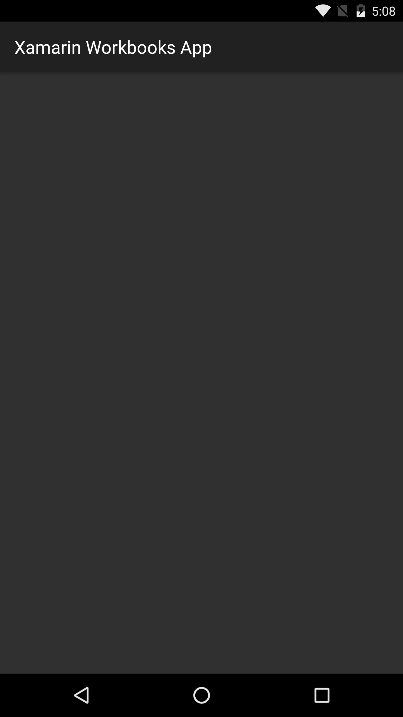

    _A blank Xamarin workbook in the Android emulator_

1. A Xamarin workbook is composed of *cells*. There are two types of cells: executable cells and documentation cells. Executable cells contain C# code that can be executed inside the workbook. Documentation cells contain text that can be formatted using markdown syntax. You build interactive workbooks by creating sequences of executable cells and documentation cells.

	Return to Xamarin Workbooks and type the following line of code into the executable cell at the top of the workbook. Then press **Shift+Enter** to insert a blank line:

	```C#
	// This is an executable cell
	```

1. Enter the following line of code on the second line:

	```C#
	DateTime.Now;
	```

1. Click the **Run** button (or press **Ctrl+Enter**) to execute the code. 

	

    _Running an executable cell_

1. Confirm that the result appears underneath the code. Use the drop-down under the **Default** button to try formatting the result in various ways.

	

    _Results of executing a cell_

1. The three buttons in the lower-right corner of each cell allow you to add an executable cell, add a documentation cell, and delete the current cell, in that order. Click the third button in the cell that was added when you executed the code in the previous cell to delete it, and confirm the deletion when prompted to do so.

	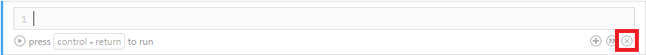

    _Deleting the newly added cell_

1. Click the middle button in the remaining cell to add a documentation cell.

	

    _Adding a documentation cell_

1. Type "This is a documentation cell" into the documentation cell. Then highlight "documentation cell" and click the **Italics** button that appears above it.

	

    _Italicizing text in a documentation cell_

1. Confirm that "documentation cell" is italicized. Then delete the documentation cell.

	

    _Adding a documentation cell_

Now that you're familiar with basic workbook concepts, including adding, deleting, and executing cells, let's build something that's relevant to Operation Remote Resupply.

<a name="Exercise2"></a>
## Exercise 2: Build an interactive workbook ##

In this exercise, you will create a Xamarin Workbook that describes how to convert Earth time to Mars time, and that includes code to perform the conversion.

1. Add a documentation cell to the workbook and enter the following text:

	```
	What time is it on Mars?
	```

1. Format the text in the cell by selecting **Format** > **Heading** > **Level 1** from the overhead menu, and confirm that it takes on the format shown below.

	

    _The workbook heading_
 
1. Add another documentation cell to the workbook. Then paste the following text into the cell to serve as an introduction to the workbook: 

	```
	Have you ever considered what time it is on Mars? It's not an abstract question when you have settlers on Mars and need to communicate with them. Earth time can be converted to Mars time in a few simple steps.  
	```

1. Add a documentation cell to the workbook and insert the text below. Then highlight "Milliseconds Since January 1, 1970" and use the **Format** > **Heading** > **Level 2** command to format the text as a subheading.

	```
	Milliseconds Since January 1, 1970

	The first step is to compute the number of milliseconds that have elapsed since January 1, 1970, in Universal Time:
	```

1. Insert a new executable cell and enter the code below.

	```C#
	DateTime value = DateTime.UtcNow;
	DateTime earthEpochDate = new System.DateTime(1970, 1, 1);
	double elapsedMilliseconds = (value - earthEpochDate).TotalMilliseconds;
	```

1. Click the **Run** button or press **Ctrl+Enter** to execute the code and display the number of milliseconds elapsed since January 1, 1970: 

	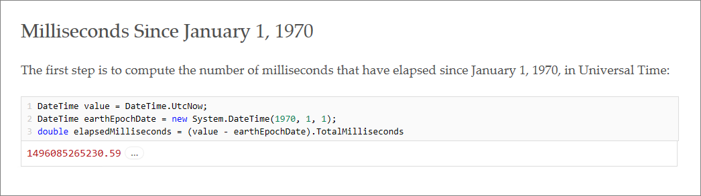

    _Computing the number of milliseconds elapsed since January 1, 1970_
 
1. Delete the executable cell that was added when you ran the code. Then add a documentation cell, insert the following text, and format the first line as a level-2 subheading:

	```
	Julian Date (Universal Time)

	The next step is to convert milliseconds into days and add the number of days between noon on January 1, 4713 B.C. and midnight on January 1, 1970 (2,440,587.5 days) to yield a Julian date: 
	```

1. Insert a new executable cell and enter the statement below. Then run it to compute a Julian date.

	```C#
	double epochJulianDate = 2440587.5 + (elapsedMilliseconds / (8.64 * Math.Pow(10, 7)));
	```

	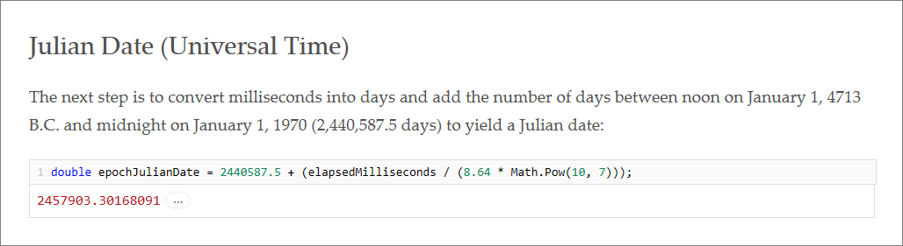

    _Computing a Julian date_

1. Delete the executable cell that was added when you ran the code, and add a new documentation cell. Insert the following text, and then format the first line as a level-2 subheading:

	```
	Julian Date (Terrestrial Time)

	Now convert the Julian date in Universal Time to a Julian date in Terrestrial Time by adding the number of leap seconds since January 1, 2017:
	```

1. Insert a new executable cell and enter the statement below. The run it to convert the Julian date to Terrestrial Time:

	```C#
	double terrestrialJulianDate = epochJulianDate + (37 + 32.184) / 86400;
	```

	

    _Converting a Julian date to Terrestrial Time_

1. Delete the executable cell that was added when you ran the code, and add a new documentation cell. Insert the following text, and then format the first line as a level-2 subheading:

	```
	Julian Date Relative to January 1, 2000

	Subtract the number of days between January 1, 1970 and January 1, 2000 to convert the terrestrial Julian date computed in the previous step into one that is relative to January 1, 2000:
	```

1. Insert a new executable cell and enter the statement below. Then run it to convert the Julian date into one that is relative to January 1, 2000:

	```C#
	double martianEpochDifference = terrestrialJulianDate - 2451545.0;
	```

	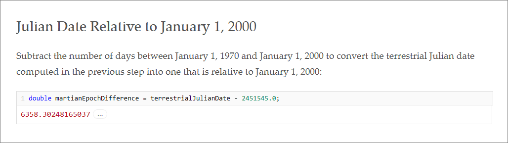

    _Rebasing the Julian date_

1. Delete the executable cell that was added when you ran the code, and add a new documentation cell. Insert the following text, and then format the first line as a level-2 subheading:

	```
	Mars Sol Date

	The equivalent of the Julian date for Mars is the Mars sol date. At midnight on January 6, 2000 on earth, it was midnight at the Martian prime meridian, so our starting point for Mars sol date is ΔJ2000 - 4.5. The length of a Martian day and Earth day differ by a ratio of 1.027491252, so we divide by that. By convention, to keep the Martial sol date positive going back to midday on December 29, 1873, we add 44,796. A slight adjustment of 0.00096 is required since the midnights aren't perfectly aligned:
	```

1. Insert a new executable cell and enter the statement below. Then run it to display the Martian sol date:

	```C#
	double martianSolDate = (((martianEpochDifference - 4.5) / 1.027491252) + 44796.0 - 0.00096);
	```

	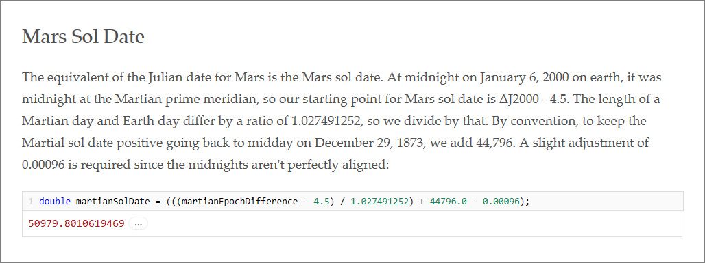

    _Computing the Martial sol date_

1. Delete the executable cell that was added when you ran the code, and add a new documentation cell. Insert the following text, and then format the first line as a level-2 subheading:

	```
	Mars Coordinated Time

	Mars Coordinated Time (MTC) is like UTC, but for Mars. Because it is just a mean time, you can  calculate it based on the Mars Sol Date like this:
	```

1. Insert a new executable cell and enter the following statement. Then run it to display the current time in Mars Coordinated Time (MTC):

	```C#
	var mct = System.TimeSpan.FromHours((martianSolDate % 1) * 24);
	mct.ToString("hh\\:mm\\:ss");
	```

	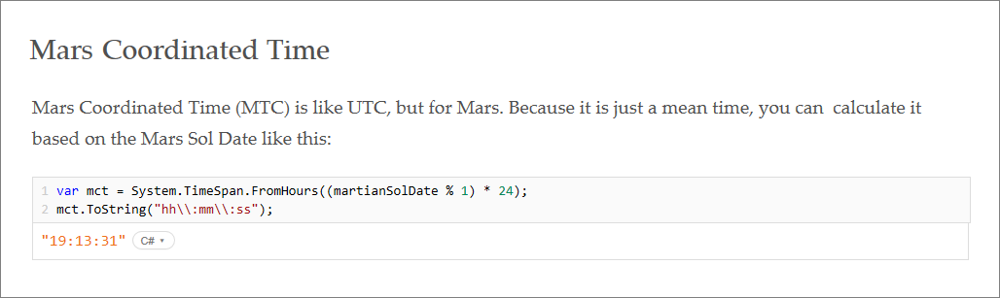

    _Computing Mars Coordinated Time_
 
1. One of the cool things about Xamarin Workbooks is that you can do almost anything you would normally do in C#, including adding methods and extension methods. To demonstrate, add the following statements to the executable cell that was added when you ran the last one:

	```C#
	static double ToMartianSolDate(this DateTime value)
	{
	    DateTime earthEpochDate = new System.DateTime(1970, 1, 1);
	    double elapsedMilliseconds = (value - earthEpochDate).TotalMilliseconds;
	    double epochJulianDate = 2440587.5 + (elapsedMilliseconds / (8.64 * Math.Pow(10, 7)));
	    double terrestrialJulianDate = epochJulianDate + (37 + 32.184) / 86400;
	    double martianEpochDifference = terrestrialJulianDate - 2451545.0;
	    double martianSolDate = (((martianEpochDifference - 4.5) / 1.027491252) + 44796.0 - 0.00096);
	    return martianSolDate;
	}
	
	static TimeSpan ToMartianTime(this DateTime value)
	{   
	    return System.TimeSpan.FromHours((value.ToMartianSolDate() % 1) * 24);
	}
	```

	These extension methods will come in handy when you add code to interact with the Android emulator in the next exercise.

Xamarin Workbooks like this one are great for creating interactive documents to teach concepts and let users try out code that implements those concepts. As yet, however, you haven't used the Workbooks app that appeared in the Android emulator when you launched Xamarin Workbooks. Let's modify the app to allow users to convert earth time to Martian time. 

<a name="Exercise3"></a>
## Exercise 3: Build a UI for the workbook and use the Xamarin UI Inspector ##

As you build a workbook, you can include code that creates a user interface from Xamarin Forms controls and displays them in the *agent* that was started along with the workbook — in this case, the app running in the Android emulator. Furthermore, you can use Xamarin Workbooks' integrated UI Inspector to examine the controls that you created and adjust control properties to fine-tune the UI.

In this exercise, you will enhance the workbook you built in Exercise 2 to show the current earth time and Mars time in the Android emulator, and learn how to use the Xamarin UI Inspector to inspect and modify control properties.

1. Add an executable cell to the workbook. Then select **File** > **Add Package...** from the overhead menu and type "Xamarin.Forms" into the search box. Select the latest **Xamarin.Forms** package, and then click **Add Package** to add the package to the workbook.

	> One of the most powerful features of Xamarin Workbooks is that you can import NuGet packages just like you can in Visual Studio. Once a package is imported, C# code that you add to the workbook can use the types in that package.

	

    _Adding Xamarin.Forms to a workbook_
 
1. Confirm that three ```#r``` statements appear referencing the assemblies imported from the package.

	

    _Statements referencing Xamarin Forms assemblies_
 
1. In the new executable cell that appears in the workbook, insert the following ```using``` statement and then run it:
 
	```C#
	using Xamarin.Forms;
	```

1. Delete the executable cell that was added when you ran the code. Add a new documentation cell and insert the following text: 

	```
	Add controls to display the current time on earth and on Mars:
	```

1. Insert a new executable cell and enter the following statements:
 
	```C#
	var page = Xamarin.Forms.Application.Current.MainPage as ContentPage;
	var layout = new StackLayout() { Margin = new Thickness(40) };
	var earthlabel = new Label() { Text = "Earth Time:", FontSize = 32 };
	var earthTimeLabel = new Label() { Text = DateTime.Now.ToString("hh:mm:ss tt"), FontSize = 32 };
	
	layout.Children.Add(earthlabel);
	layout.Children.Add(earthTimeLabel);
	
	var marslabel = new Label() { Text = "Martian Time:", FontSize = 32 };
	var marsTimeLabel = new Label() { Text = earthEpochDate.Add(mct).ToString("hh:mm:ss tt"), FontSize = 32 };
	
	layout.Children.Add(marslabel);
	layout.Children.Add(marsTimeLabel);
	
	page.Content = layout;
	```

1. Run the code and confirm that the following page appears in the Android emulator:

	

    _Android emulator showing earth time and Mars time_
 
1. Now let's use a software timer to update the times shown on the page once a second. Begin by deleting the executable cell that was added when you ran the last cell and adding a documentation cell. Insert the following text into the documentation cell: 	
	
	```
	Use a timer to refresh the display once per second:
	```

1. Insert a new executable cell and enter the following code to start a device timer and update the app's UI every second:

	```C#
	Device.StartTimer(TimeSpan.FromSeconds(1), () =>
	{
	    // LOCAL EARTH TIME
	    earthTimeLabel.Text = DateTime.Now.ToString("hh:mm:ss tt");
	
	    // EARTH UTC TO MARTIAN TIME
	    marsTimeLabel.Text = earthEpochDate.Add(DateTime.UtcNow.ToMartianTime()).ToString("hh:mm:ss tt");
	    return true;
	});
	```

1. Run the cell and confirm that the times shown in the emulator update in real time.

1. One of Xamarin Workbooks' more powerful features is the Xamarin UI Inspector, which lets you inspect values in the UI and adjust them without making permanent changes to your code. To open the inspector, click **View Inspector** in the lower-left corner of the Xamarin Workbooks window.

	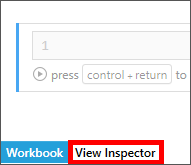

    _Opening the Xamarin UI Inspector_
 
1. Select **Xamarin.Forms** from the drop-down list to view the Xamarin Forms control tree. 

	

    _Viewing the Xamarin Forms controls_
 
1. In the UI Inspector, click the first ```Label``` control to select that control. As an alternative, you can click the **select a view** button and then click "Earth Time" in the Android emulator. 

	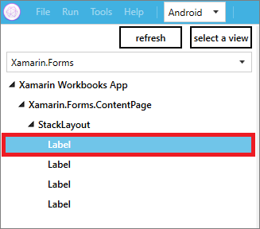

    _Selecting the "Earth Time" Label control_

1. Locate the ```TextColor``` property in the properties panel on the right and change the **R** value to 217 and the **A** (alpha transparency) property to 100%.

	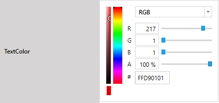

    _Changing the Label control's foreground color_ 

1. Return to the Android emulator and confirm that "Earth Time" changed to red.

	

    _Modified Label control in the emulator_ 

1. Repeat this process for the remaining three ```Label``` controls to change their text color to red.

1. Select the ```ContentPage``` control.

	

    _Selecting the ContentPage_

1. Go to the properties panel and set the page's **R**, **G**, and **B** values to 0 and the **A** value to 100% to change the page background color to black.

1. Return to the Android emulator and confirm that it now displays red text against a black background.

	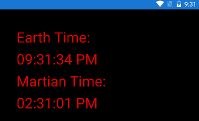

    _The updated UI using the inspector_ 

1. Click the **refresh** button in the UI Inspector to update the preview shown there. If you would like, use your mouse to change the orientation of the preview.	

	

    _Refreshing the UI preview_ 

The UI Inspector is great for examining the controls that form an app's UI and tweaking those controls as needed. Not all UI properties can be manipulated directly from the inspector, but most of them can.

<a name="Exercise4"></a>
## Exercise 4: Use the XAML Previewer for Xamarin Forms ##

When you create XAML UIs by typing text and angle brackets, you don't know precisely how the UI will look like until you run the app. Tweaking a UI often means repeatedly making changes to the XAML and rerunning the app to gauge the effect of those changes. But there is a better way. In this exercise, you will use Visual Studio 2017's integrated previewer for Xamarin Forms to see a live preview of the XAML that you enter. You will also learn how to use the XAML Previewer to see how the app will look on screens of various sizes.  

1. Open the DroneLander solution in Visual Studio 2017. Then open **MainPage.xaml** in the **DroneLander (Portable)** project.

	

    _MainPage.xaml in the XAML editor_ 

1. Use Visual Studio's **View** > **Other Windows** > **Xamarin.Forms Previewer** command to open the Xamarin Forms Previewer. Then use the **Window** > **New Vertical Tab Group** command to position the preview window next to the XAML editor.

	

    _Previewing XAML in the Xamarin Forms Previewer_ 

	Observe that the preview window shows not only the XAML elements declared in **MainPage.xaml**, but also changes made at run-time by custom renderers. Most controls render perfectly in the Xamarin Forms Previewer, but be aware that some platform-specific elements such as the custom effect used to change the font on Android will not be seen until run-time.

1. As an experiment, change the case of the "Altitude" and "Descent Rate" labels in the XAML editor, and check out the corresponding changes in the Xamarin Forms Previewer.

	

    _Changes displayed in the Xamarin Forms Previewer_ 

1. The Xamarin Forms Previewer also allows you to preview the UI in different form factors and orientations. To demonstrate, click **Tablet** in the preview window, and then click the **landscape mode icon** in the upper-right corner of the window to preview **MainPage.xaml** in landscape mode on a tablet.

	

    _Previewing the UI on a tablet in landscape mode_ 

1. Finish up by undoing the case changes made to the labels in Step 3.

The Xamarin Forms Previewer streamlines the development process by allowing you to see UI changes as you make them, and to do so without launching the app over and over again. But there's another tool you should be familiar with if you're doing Xamarin Forms development: the Xamarin Profiler.

<a name="Exercise5"></a>
## Exercise 5: Diagnose potential performance issues with the Xamarin Profiler ##

Performance is crucial to any app. If an app performs sluggishly, users are liable to abandon it in favor of competing apps. Accordingly, the Xamarin Profiler included in Visual Studio Enterprise 2017 provides tools for measuring performance and identifying potential trouble spots. In this exercise, you will use the Xamarin Profiler to analyze Drone Lander.

> This exercise requires Visual Studio Enterprise 2017. If you are using the Community or Professional edition of Visual Studio 2017, simply read through this exercise to learn about the some of the profiler's features and capabilities.

1. In Visual Studio 2017, open the **DroneLander** solution created in the previous lab, if not already open from the previous exercise.

1. Use the **Tools** > **Xamarin Profiler** menu in Visual Studio to compile your project in debug mode and start the Xamarin Profiler.

1. Select **Performance** as the instrument "target" and click **Choose** to run the app and start a profiling session.

	

    _Choosing the Performance target in Xamarin Profiler_ 

1. In the Xamarin Profiler window, change the "Group by" filter to **Assembly** and observe the top memory allocations related to app performance.

	

    _Filtering memory allocations by assembly_ 

1. Switch to **Drone Lander app** running in the emulator and start a landing attempt, then immediately switch back to the **Xamarin Profiler** and observe the changes to memory allocation based on assembly, such as the gradual increase in memory use for **Xamarin.Forms.Core.dll**. 

	

    _Observing the gradual increase in memory allocation in Xamarin.Forms.Core.dll_ 

	Although gradual memory increase in a specific assembly may not be an immediate problem, over time these resources will need to be disposed or device resource constraints could cause unexpected behavior or even a crash. The gradual increase of memory use by Xamarin.Forms.Core.dll indicated a possible opportunity to optimize code or processes.

1. Experiment with viewing profile instrumentation information in other ways, such as selecting the **Call tree** tab and then expanding individual symbols to get a more granular view of resource allocations.

	

    _Observing and expanding the Call tree in Xamarin Profiler_ 

1. Click the **Stop profiling** button in the Xamarin Profiler IDE toolbar to end your profiling session.

	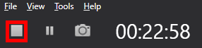

    _Ending a profiling session in Xamarin Profiler_ 

This was just a quick example of using the Xamarin Profiler to diagnose potential performance issues in an app. The Xamarin Profiler is a powerful, comprehensive performance diagnostic tool in your mobile development toolkit. 

In this exercise you experimented with viewing and diagnosing performance issues based on memory allocations. Other helpful areas to experiment with are the Time Profiler, which measures exactly how much time is spent in each method of an application and Cycles, which can easily track references to objects that are not properly disposed.

<a name="Summary"></a>
## Summary ##

With Xamarin Workbooks you have a powerful documentation tool to provide rich, interactive documentation to colleagues and peers without the need for a creating projects, or even installing a development IDE. Combining the UI Inspector, XAML Previewer for Xamarin.Forms, and the Xamarin Profiler rounds out this toolkit to make sure you have everything you need, as a mobile app developer, to create polished, performant, scalable, and useful mobile apps with the Xamarin platform.

That's it for Part 5 of Operation Remote Resupply. In Part 6, you will be bringing it all together by building on the Mobile Center concepts from Part 3 to integrate testing into your app lifecycle, as well as leveraging the power of Xamarin UI Tests and Xamarin Test Cloud to create and execute automated testing scenarios that validate the functionality your mobile app.