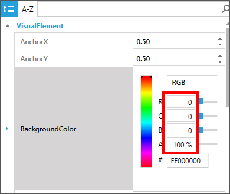

<a name="HOLTitle"></a>
# Operation Remote Resupply, Part 5 #

---

<a name="Overview"></a>
## Overview ##

Not only have modern mobile apps changed the way developers design, build, and distribute apps, but also the way code, processes, and concepts get analyzed, validated and recorded. Using standard "static" documentation tools such as web pages and printed materials, although helpful, are often challenging, especially to the uninitiated developer, unfamiliar with key concepts and platforms. The process of typing in (or even copying and pasting) code snippets and examples is useful, but more often than not, developers need to create entire projects simply to test a simple line of code, creating a barrier and distraction from actual learning.  

To address this need, tools and services have been created to mitigate these problems, often by removing the need for an IDE, such as in Roslyn, the Microsoft open source .NET compiler service, Jupyter, and [Xamarin Workbooks](https://developer.xamarin.com/guides/cross-platform/workbooks/ "Xamarin Workbooks"), where an "immersive" experience is created for a developer, without the extra overhead of solutions and projects. Xamarin Workbooks combines these concepts by allowing interactive documentation to be combined with live coding, making it simple for a developer to learn and experiment with a native platform, including support for Android, iOS, Mac and Windows desktop apps.

Even well-designed mobile apps have hidden or problematic performance issues, difficult to diagnose through simple user testing processes, Working with cross-platform solutions compounds these challenges, as some problems may exist for one platform, but not another. To provide the type of rich diagnostic profiling and instrumentation needed for cross-platform development, the Xamarin platform includes the [Xamarin Profiler](https://developer.xamarin.com/guides/cross-platform/profiler/ "Xamarin Profiler"). The Xamarin Profiler provides a graphical interface for the [Mono log profiler](http://www.mono-project.com/docs/debug+profile/profile/profiler/ "Mono log profiler"), seamlessly integrated into your existing Xamarin toolchain, to collect information about your Xamarin apps. The Xamarin Profiler is the ideal tool to diagnose memory leaks and resolve potential performance bottlenecks. 

In this lab, you will use Xamarin Workbooks to create a rich, interactive document to convert Earth time to Mars time based on calculations provided by Mission Control. You will also get first-hand experience using the Xamarin UI Inspector, Xamarin Previewer, and the Xamarin Profiler to tweak a Xamarin Forms user interface and diagnose potential performance issues.

<a name="Objectives"></a>
### Objectives ###

In this lab, you will learn how to:

- Create a Xamarin Workbook for Android
- Add documentation and live calculations to a Xamarin Workbook
- Inspect code using the Xamarin UI Inspector
- Use the XAML Previewer for Xamarin to view UI updates
- Diagnose potential performance issues with Xamarin Profiler

<a name="Prerequisites"></a>
### Prerequisites ###

The following are required to complete this lab:

- [Visual Studio Community 2017](https://www.visualstudio.com/vs/) or higher
- A computer running Windows 10 that supports hardware emulation using Hyper-V. For more information, and for a list of requirements, see https://msdn.microsoft.com/en-us/library/mt228280.aspx. 
- [Xamarin Workbooks](https://developer.xamarin.com/guides/cross-platform/workbooks/install/ "Xamarin Workbooks") for Windows
- [Xamarin Profiler](https://developer.xamarin.com/guides/cross-platform/profiler/#Download_and_Install "Xamarin Profiler") for Windows
- [Visual Studio Enterprise 2017](https://www.visualstudio.com/vs/) for profiling instrumentation using Xamarin Profiler (optional)

If you wish to build and run the iOS version of the app, you also have to have a Mac running OS X 10.11 or higher, and both the Mac and the PC running Visual Studio 2017 require further configuration. For details, see https://developer.xamarin.com/guides/ios/getting_started/installation/windows/.

---

<a name="Exercises"></a>
## Exercises ##

This lab includes the following exercises:

- [Exercise 1: Create a Xamarin Workbook for Android](#Exercise1)
- [Exercise 2: Build an interactive workbook](#Exercise2)
- [Exercise 3: Inspect code using the Xamarin UI Inspector](#Exercise3)
- [Exercise 4: Use the XAML Previewer for Xamarin to view UI updates](#Exercise4)
- [Exercise 5: Diagnose potential performance issues with Xamarin Profiler](#Exercise5)
  
Estimated time to complete this lab: **45** minutes.

<a name="Exercise1"></a>
## Exercise 1: Create a Xamarin Workbook for Android ##

Xamarin Workbooks are essentially markdown files with a ".workbook" extension, making them both portable and easy to manage. Workbooks can be created for Android, iOS, Windows console, and desktop (WPF) apps, with full support for NuGet packages. Rich code-block support, using the standard markup "triple-backtick" pattern, is also used, making it easy to convert a standard markdown file into a Xamarin Workbook for a more interactive learning experience.

In this exercise, you will create a Xamarin Workbook targeting Android devices and learn the basics of working with cells. 

1. Launch Xamarin Workbooks, select **Android** as the framework, and click **Create**. 
    
	

    _Creating a workbook for Android_

1. After a short delay, a blank Xamarin workbook will be created, and Xamarin Workbooks will launch your default Android emulator. Wait for the emulator to appear and display a default page.
 
	

    _A blank Xamarin workbook in the Android emulator_

1. A Xamarin workbook is composed of *cells*. There are two types of cells: executable cells and documentation cells. Executable cells contain C# code that can be executed inside the workbook. Documentation cells contain text that can be formatted using markdown syntax. You build interactive workbooks by creating sequences of executable cells and documentation cells.

	Return to Xamarin Workbooks and type the following line of code into the executable cell at the top of the workbook. Then press **Shift+Enter** to insert a blank line:

	```C#
	// This is an executable cell
	```

1. Enter the following line of code on the second line:

	```C#
	DateTime.Now;
	```

1. Click the **Run** button (or press **Ctrl+Enter**) to execute the code. 

	

    _Running an executable cell_

1. Confirm that the result appears underneath the code. Use the drop-down under the **Default** button to try formatting the result in various ways.

	

    _Results of executing a cell_

1. The three buttons in the lower-right corner of each cell allow you to add an executable cell, add a documentation cell, and delete the current cell, in that order. Click the third button in the cell that was added when you executed the code in the previous cell to delete it, and confirm the deletion when prompted to do so.

	

    _Deleting the newly added cell_

1. Click the middle button in the remaining cell to add a documentation cell.

	

    _Adding a documentation cell_

1. Type "This is a documentation cell" into the documentation cell. Then highlight "documentation cell" and click the **Italics** button that appears above it.

	

    _Italicizing text in a documentation cell_

1. Confirm that "documentation cell" is italicized. Then delete the documentation cell.

	

    _Adding a documentation cell_

Now that you're familiar with basic workbook concepts, including adding, deleting, and executing cells, let's build something that's relevant to Operation Remote Resupply.

<a name="Exercise2"></a>
## Exercise 2: Build an interactive workbook ##

In this exercise, you will create a Xamarin Workbook that describes how to convert Earth time to Mars time, and that includes code to perform the conversion.

1. Add a documentation cell to the workbook and enter the following text:

	```
	What time is it on Mars?
	```

1. Format the text in the cell by selecting **Format** > **Heading** > **Level 1** from the overhead menu, and confirm that it takes on the format shown below.

	

    _The workbook heading_
 
1. Add another documentation cell to the workbook. Then paste the following text into the cell to serve as an introduction to the workbook: 

	```
	Have you ever considered what time it is on Mars? It's not an abstract question when you have settlers on Mars and need to communicate with them. Earth time can be converted to Mars time in a few simple steps.  
	```

1. Add a documentation cell to the workbook and insert the text below. Then highlight "Milliseconds Since January 1, 1970" and use the **Format** > **Heading** > **Level 2** command to format the text as a subheading.

	```
	Milliseconds Since January 1, 1970

	The first step is to compute the number of milliseconds that have elapsed since January 1, 1970, in Universal Time:
	```

1. Insert a new executable cell and enter the code below.

	```C#
	DateTime value = DateTime.UtcNow;
	DateTime earthEpochDate = new System.DateTime(1970, 1, 1);
	double elapsedMilliseconds = (value - earthEpochDate).TotalMilliseconds;
	```

1. Click the **Run** button or press **Ctrl+Enter** to execute the code and display the number of milliseconds elapsed since January 1, 1970: 

	

    _Computing the number of milliseconds elapsed since January 1, 1970_
 
1. Delete the executable cell that was added when you ran the code. Then add a documentation cell, insert the following text, and format the first line as a level-2 subheading:

	```
	Julian Date (Universal Time)

	The next step is to convert milliseconds into days and add the number of days between noon on January 1, 4713 B.C. and midnight on January 1, 1970 (2,440,587.5 days) to yield a Julian date: 
	```

1. Insert a new executable cell and enter the statement below. Then run it to compute a Julian date.

	```C#
	double epochJulianDate = 2440587.5 + (elapsedMilliseconds / (8.64 * Math.Pow(10, 7)));
	```

	

    _Computing a Julian date_

1. Delete the executable cell that was added when you ran the code, and add a new documentation cell. Insert the following text, and then format the first line as a level-2 subheading:

	```
	Julian Date (Terrestrial Time)

	Now convert the Julian date in Universal Time to a Julian date in Terrestrial Time by adding the number of leap seconds since January 1, 2017:
	```

1. Insert a new executable cell and enter the statement below. The run it to convert the Julian date to Terrestrial Time:

	```C#
	double terrestrialJulianDate = epochJulianDate + (37 + 32.184) / 86400;
	```

	

    _Converting a Julian date to Terrestrial Time_

1. Delete the executable cell that was added when you ran the code, and add a new documentation cell. Insert the following text, and then format the first line as a level-2 subheading:

	```
	Julian Date Relative to January 1, 2000

	Subtract the number of days between January 1, 1970 and January 1, 2000 to convert the terrestrial Julian date computed in the previous step into one that is relative to January 1, 2000:
	```

1. Insert a new executable cell and enter the statement below. Then run it to convert the Julian date into one that is relative to January 1, 2000:

	```C#
	double martianEpochDifference = terrestrialJulianDate - 2451545.0;
	```

	

    _Rebasing the Julian date_

1. Delete the executable cell that was added when you ran the code, and add a new documentation cell. Insert the following text, and then format the first line as a level-2 subheading:

	```
	Mars Sol Date

	The equivalent of the Julian date for Mars is the Mars sol date. At midnight on January 6, 2000 on earth, it was midnight at the Martian prime meridian, so our starting point for Mars sol date is ΔJ2000 - 4.5. The length of a Martian day and Earth day differ by a ratio of 1.027491252, so we divide by that. By convention, to keep the Martial sol date positive going back to midday on December 29, 1873, we add 44,796. A slight adjustment of 0.00096 is required since the midnights aren't perfectly aligned:
	```

1. Insert a new executable cell and enter the statement below. Then run it to display the Martian sol date:

	```C#
	double martianSolDate = (((martianEpochDifference - 4.5) / 1.027491252) + 44796.0 - 0.00096);
	```

	

    _Computing the Martial sol date_

1. Delete the executable cell that was added when you ran the code, and add a new documentation cell. Insert the following text, and then format the first line as a level-2 subheading:

	```
	Mars Coordinated Time

	Mars Coordinated Time (MTC) is like UTC, but for Mars. Because it is just a mean time, you can  calculate it based on the Mars Sol Date like this:
	```

1. Insert a new executable cell and enter the following statement. Then run it to display the current time in Mars Coordinated Time (MTC):

	```C#
	var mct = System.TimeSpan.FromHours((martianSolDate % 1) * 24);
	mct.ToString("hh\\:mm\\:ss");
	```

	

    _Computing Mars Coordinated Time_
 
1. One of the cool things about Xamarin Workbooks is that you can do almost anything you would normally do in C#, including adding methods and extension methods. To demonstrate, add the following statements to the executable cell that was added when you ran the last one:

	```C#
	static double ToMartianSolDate(this DateTime value)
	{
	    DateTime earthEpochDate = new System.DateTime(1970, 1, 1);
	    double elapsedMilliseconds = (value - earthEpochDate).TotalMilliseconds;
	    double epochJulianDate = 2440587.5 + (elapsedMilliseconds / (8.64 * Math.Pow(10, 7)));
	    double terrestrialJulianDate = epochJulianDate + (37 + 32.184) / 86400;
	    double martianEpochDifference = terrestrialJulianDate - 2451545.0;
	    double martianSolDate = (((martianEpochDifference - 4.5) / 1.027491252) + 44796.0 - 0.00096);
	
	    return martianSolDate;
	}
	
	static TimeSpan ToMartianTime(this DateTime value)
	{   
	    return System.TimeSpan.FromHours((value.ToMartianSolDate() % 1) * 24);
	}
	```

	These extension methods will come in handy when you add code to interact with the Android emulator in the next exercise.

Xamarin Workbooks like this one are great for creating interactive documents to teach concepts and let users try out code that implements those concepts. As yet, however, you haven't used the Workbooks app that appeared in the Android emulator when you launched Xamarin Workbooks. Let's modify the app to allow users to convert earth time to Martian time. 

<a name="Exercise3"></a>
## Exercise 3: Inspect code using the Xamarin UI Inspector ##

Xamarin Workbooks are not only interactive in the editor, but can also communicate with external processes, like a console window, WPF app, and iOS and Android emulator. Since an emulator gets started when a Xamarin Workbook is created, you only need to write a few lines of code to interact with it. Interaction with the emulator can come in various forms, such as creating UI controls to display on a page, as well as inspecting and adjusting control properties in the Xamarin UI Inspector.

In this exercise you will be adding documentation and code to your workbook to display an Earth to Mars time converter in the emulator, as well as inspecting and adjusting properties using the Xamarin UI Inspector built into Xamarin Workbooks.

---

1. Add an executable cell to the workbook. Then select **File** > **Add Package...** from the overhead menu and type "Xamarin.Forms" into the search box. Select the latest **Xamarin.Forms** package, and then click **Add Package** to add the package to the workbook.

	> One of the most powerful features of Xamarin Workbooks is that you can import NuGet packages just like you can in Visual Studio. Once a package is imported, C# code that you add to the workbook can use the types in that package.

	

    _Adding Xamarin.Forms to a workbook_
 
1. Confirm that three ```#r``` statements appear referencing the assemblies imported from the package.

	

    _Statements referencing Xamarin Forms assemblies_
 
1. In the new executable cell that appears in the workbook, insert the following ```using``` statement:
 
	```C#
	using Xamarin.Forms;
	```

---

1. Open Xamarin Workbooks to the document created earlier, if not already open from the previous exercises.

1. Scroll to the bottom of the document, add a new **documentation cell** and insert the following content: 

	```Text
	Now with all the “rocket science” code written, we can easily display these values in a Xamarin Forms app. Let’s start with showing the currert Earth Time, by adding a StackLayout and Label to a Xamarin Forms Content Page:
	```
1. Insert a new **executable cell** and enter the following code to create a Xamarin Forms ```StackLayout``` control and populate the control with additional controls for displaying calculations created earlier in your workbook:
 
	```C#
	var page = Xamarin.Forms.Application.Current.MainPage as ContentPage;
	var layout = new StackLayout() { Margin = new Thickness(40) };
	var earthlabel = new Label() { Text = "Earth Time:", FontSize = 32 };
	var earthTimeLabel = new Label() { Text = DateTime.Now.ToString("hh:mm:ss tt"), FontSize = 32 };
	
	layout.Children.Add(earthlabel);
	layout.Children.Add(earthTimeLabel);
	
	var marslabel = new Label() { Text = "Martian Time:", FontSize = 32 };
	var marsTimeLabel = new Label() { Text = earthEpochDate.Add(mct).ToString("hh:mm:ss tt"), FontSize = 32 };
	
	layout.Children.Add(marslabel);
	layout.Children.Add(marsTimeLabel);
	
	page.Content = layout;
	```
1. Observe the use of ```Xamarin.Forms.Application.Current.MainPage as ContentPage``` in the first line of code to instantiate the ```page``` variable. By using **Xamarin.Forms.Application.Current.MainPage** you can "talk to" the page displayed by Xamarin Workbooks in the emulator.
1. Click **Run** to  execute the code and observe the result of ```Xamarin.Forms.StackLayout``` in the code editor.

	

    _Executing code to create Xamarin Forms controls dynamically_
 
1. Return to the Android emulator that was started when you created your workbook, and notice all your calculations have come together perfectly, and populated controls on the page to display values:

	

    _Viewing Earth to Mars conversion in the Android emulator_
 
	You have to admit that was pretty easy, and pretty cool, however in order to get real-time, up-to-the-second conversions you would have to execute the code in your workbook constantly. You can make it easier by adding a few lines of code to perform constant updates in the app just by adding a bit more documentation and code.

1. Insert a new **documentation cell** and insert the following content: 	
	
	```Text
	Better yet, you can even make your Martian Time Calculator realtime, but taking advantage of the Xamarin Forms platform device timer, like this:
	```
1. Insert a new **executable cell** and enter the following code to leverage the Xamarin Forms ```Device.StartTimer``` to update your calculations and display every second:

	```C#
	Device.StartTimer(TimeSpan.FromSeconds(1), () =>
	{
	    //YOUR LOCAL EARTH TIME
	    earthTimeLabel.Text = DateTime.Now.ToString("hh:mm:ss tt");
	
	    //EARTH UTC TO MARTIAN TIME
	    marsTimeLabel.Text = earthEpochDate.Add(DateTime.UtcNow.ToMartianTime()).ToString("hh:mm:ss tt");
	    return true;
	});
	```

	```Text
	Now, next time someone asks you “What time is it on Mars?” not only will you know, but you can show them how to calculate it themselves…just in case you’re stuck in traffic in the Asteroid Belt.
	```
1. Insert one final **documentation cell** and insert the following content to finish out your documenation: 

	Now that your Earth to Mars time conversion process is well documented and running well in the emulator, you may want to adjust the look and feel of the display without making permanent changes to your code. This is where the Xamarin UI Inspector comes in handy.

1. Still in your document in Xamarin Workbooks, select the **View Inspector** tab at the bottom left corner of the IDE.

	

    _Selecting the Xamarin UI Inspector tab_
 
1. Change the inspector platform to **Xamarin.Forms** to view the document explorer in Xamarin Forms control semantics. 

	

    _Changing the inspector platform to Xamarin.Forms_
 
1. Adjust both **Xamarin Workbooks** and the **Android emulator** to view viewed side-by-side on your desktop.

	

    _Viewing the inspector and emulator side-by-side_
 
1. In the UI Inspector, click **select a view** and then select the **Earth Time** Label in the emulator to set the ```Label``` as the selected view. 

	

    _The select a view option in the inspector_

1. Locate the **TextColor** property in the inspector properties "Text" panel and change the **R** value to "217" and the **A** (alpha transparency) property to **100%** to change the foreground color to red and observe the immediate updates in the emulator.

	

    _Changing the Earth Time label foreground color_ 

1. Repeat this process for the remaining three (3) labels to change the foreground color of the display to red.

1. Once last time, click **select a view** and then immediately select **any open area around the outer edge** of the page in the emulator to set the ```ContentPage``` as the selected view.
1. Locate the **BackgroundColor** property in the inspector properties "Visual Element" panel and make sure the **R**, **G**, and **B** values are set to "0" and then change the **A** (alpha transparency) property to **100%** to change the page background color to black.

	

    _Changing the Background color of the ContentPage in the inspector_ 

1. Observe the final. more "Mars-like" UI updates in the emulator.

	

    _The updated UI using the inspector_ 

1. To update the inspector UI view with recent changes, click **Refresh** and observe the updates in a three-dimensional view. Additionally, you can use your mouse to drag the view palette to find an alignment that works best for you.	

	

    _Refreshing the inspector UI view with recent changes_ 

Sending Xamarin Workbooks content directly to an emulator, and then tweaking the UI elements, is a great way to get familiar with the code and structure of an app, as well as create a quick prototype or proof-of-concept. Although not all properties can be manipulated directly from the inspector, a large number of properties are available for experimentation, including ```Scale``` and ```Rotation```.

More importantly, you now have a comprehensive, interactive document to serve as a learning tool you can distribute to your peers, colleagues, and friends, who can then simply open your creation in Xamarin Workbooks and learn how to convert Earth time to Mars time, in a simple and interactive way, without writing a single line of code.

<a name="Exercise4"></a>
## Exercise 4: Use the XAML Previewer for Xamarin.Forms to view UI updates ##

Creating a great mobile app experience is easy with Xamarin Forms, and creating a great UI is even easier. Using MVVM patterns and data binding concepts results in a clean design and separation logic, however working directly in the XAML code window often prevents you from seeing the impact of your changes until after you deploy your updates to an emulator or device. The XAML Previewer for Xamarin.Forms is designed to address this challenge by rendering page content and controls in an integrated window within the Visual Studio IDE.

In this exercise you will be setting up your Visual Studio 2107 environment to use and experiment with the XAML Previewer for Xamarin.Forms to view and adjust UI elements in your Drone Lander app.

1. In Visual Studio 2017, open the **DroneLander** solution created in the previous lab.
1. Open **MainPage.xaml** in the **DroneLander (Portable)** project to view the XAML code window.

	

    _The MainPage.xaml XAML code window in the DroneLander (Portable) project_ 

1. Use the **View** > **Other Windows** > **Xamarin.Forms Previewer** menu in Visual Studio to open the preview window. 
1. Use the **Window** > **New Vertical Tab Group** menu to position it side-by-side with MainPage.xaml.

	

    _Showing the Xamarin.Forms Previewer side-by-side with a XAML code editor window_ 

1. Observe how many (but not all) user interface elements are rendered based on the XAML contained in MainPage.xaml, and also reflect runtime code changes, like implementation of both the ```FuelControlRenderer``` and ```ThrottleControlRenderer``` and the ```ActionLabel``` binding on the Start button.

	>Although most controls in the Xamarin.Forms Previewer render perfectly, some platform-specific code, such as the assignment of a custom font effect for Android, are not able to be seen until runtime.

1. As an experiment, using the MainPage.xaml **XAML code editor**, change the case of both the **Altitude** and **Descent Rate** labels to upper case to see live, real-time changes in the Xamarin.Forms Previewer window.

	

    _The result of temporarily changing labels to upper case as displayed in the Xamarin.Forms Previewer_ 

	The Xamarin.Forms Previewer supports both Android and iOS devices, as well as generic phone and tablet form factors. Viewing a rendered version in any orientation for these devices is simple.

1. In the **Xamarin.Forms Previewer window**, select **Tablet** as the "Device" then click the **landscape mode icon** in the upper right corner of the window to view MainPage.xaml rendered in landscape mode on a tablet form factor.

	

    _Viewing MainPage.xaml on a tablet form factor in landscape mode_ 

	>If you prefer the look of your labels in upper case, feel free to change the remaining controls to match, otherwise you can undo your changes in the XAML code editor.

Using the XAML Previewer for Xamarin.Forms can make quick work of user interface control and layout updates, to ensure you get your layout and design just right before running your app on a device or emulator.

In the next exercise you will be switching gears a bit to get familiar with another great Xamarin Forms tool, the Xamarin Profiler.

<a name="Exercise5"></a>
## Exercise 5: Diagnose potential performance issues with Xamarin Profiler ##

**If you do not have Visual Studio Enterprise 2017, you will not be able to perform all the steps in this exercise. Xamarin Profiler IDE integration is available in all release versions of Xamarin, however, [Visual Studio Enterprise](https://www.xamarin.com/compare-visual-studio "Visual Studio Enterprise") is required for profiling. If you are using Visual Studio Community or Professional 2017 you can review this lab and use it as a reference for later.**

More often than not, the success of a mobile app depends on the end user experience. As a developer you might have implemented some really awesome features in your app, but if the app is sluggish or prone to crashes, most users will uninstall it.
 
To proactively address this challenge, the Xamarin Profiler provides a large of profiling "instruments" such as Allocations, Cycles, and Time Profiler to measure and analyze app performance.

In this exercise you will use and experiment with the Xamarin Profiler to view and identify potential performance issue in your Drone Lander app.

1. In Visual Studio 2017, open the **DroneLander** solution created in the previous lab, if not already open from the previous exercise.
1. Use the **Tools** > **Xamarin Profiler** menu in Visual Studio to compile your project in debug mode and start the Xamarin Profiler.
1. Select **Performance** as the instrument "target" and click **Choose** to run the app and start a profiling session.

	

    _Choosing the Performance target in Xamarin Profiler_ 

1. In the Xamarin Profiler window, change the "Group by" filter to **Assembly** and observe the top memory allocations related to app performance.

	

    _Filtering memory allocations by assembly_ 

1. Switch to **Drone Lander app** running in the emulator and start a landing attempt, then immediately switch back to the **Xamarin Profiler** and observe the changes to memory allocation based on assembly, such as the gradual increase in memory use for **Xamarin.Forms.Core.dll**. 

	

    _Observing the gradual increase in memory allocation in Xamarin.Forms.Core.dll_ 

	Although gradual memory increase in a specific assembly may not be an immediate problem, over time these resources will need to be disposed or device resource constraints could cause unexpected behavior or even a crash. The gradual increase of memory use by Xamarin.Forms.Core.dll indicated a possible opportunity to optimize code or processes.

1. Experiment with viewing profile instrumentation information in other ways, such as selecting the **Call tree** tab and then expanding individual symbols to get a more granular view of resource allocations.

	

    _Observing and expanding the Call tree in Xamarin Profiler_ 

1. Click the **Stop profiling** button in the Xamarin Profiler IDE toolbar to end your profiling session.

	

    _Ending a profiling session in Xamarin Profiler_ 

This was just a quick example of using the Xamarin Profiler to diagnose potential performance issues in an app. The Xamarin Profiler is a powerful, comprehensive performance diagnostic tool in your mobile development toolkit. 

In this exercise you experimented with viewing and diagnosing performance issues based on memory allocations. Other helpful areas to experiment with are the Time Profiler, which measures exactly how much time is spent in each method of an application and Cycles, which can easily track references to objects that are not properly disposed.

<a name="Summary"></a>
## Summary ##

With Xamarin Workbooks you have a powerful documentation tool to provide rich, interactive documentation to colleagues and peers without the need for a creating projects, or even installing a development IDE. Combining the UI Inspector, XAML Previewer for Xamarin.Forms, and the Xamarin Profiler rounds out this toolkit to make sure you have everything you need, as a mobile app developer, to create polished, performant, scalable, and useful mobile apps with the Xamarin platform.

That's it for Part 5 of Operation Remote Resupply. In Part 6, you will be bringing it all together by building on the Mobile Center concepts from Part 3 to integrate testing into your app lifecycle, as well as leveraging the power of Xamarin UI Tests and Xamarin Test Cloud to create and execute automated testing scenarios that validate the functionality your mobile app.