<a name="HOLTitle"></a>
# Operation Remote Resupply, Part 5 #

---

<a name="Overview"></a>
## Overview ##

Not only have modern mobile apps changed the way developers design, build, and distribute apps, but also the way code, processes, and concepts get analyzed, validated and recorded. Using standard "static" documentation tools such as web pages and printed materials, although helpful, are often challenging, especially to the uninitiated developer, unfamiliar with key concepts and platforms. The process of typing in (or even copying and pasting) code snippets and examples is useful, but more often than not, developers need to create entire projects simply to test a simple line of code, creating a barrier and distraction from actual learning.  

To address this need, tools and services have been created to mitigate these problems, often by removing the need for an IDE, such as in Roslyn, the Microsoft open source .NET compiler service, Jupyter, and [Xamarin Workbooks](https://developer.xamarin.com/guides/cross-platform/workbooks/ "Xamarin Workbooks"), where an "immersive" experience is created for a developer, without the extra overhead of solutions and projects. Xamarin Workbooks combines these concepts by allowing interactive documentation to be combined with live coding, making it simple for a developer to learn and experiment with a native platform, including support for Android, iOS, Mac and Windows desktop apps.

Even well-designed mobile apps have hidden or problematic performance issues, difficult to diagnose through simple user testing processes, Working with cross-platform solutions compounds these challenges, as some problems may exist for one platform, but not another. To provide the type of rich diagnostic profiling and instrumentation needed for cross-platform development, the Xamarin platform includes the [Xamarin Profiler](https://developer.xamarin.com/guides/cross-platform/profiler/ "Xamarin Profiler"). The Xamarin Profiler provides a graphical interface for the [Mono log profiler](http://www.mono-project.com/docs/debug+profile/profile/profiler/ "Mono log profiler"), seamlessly integrated into your existing Xamarin toolchain, to collect information about your Xamarin apps. The Xamarin Profiler is the ideal tool to diagnose memory leaks and resolve potential performance bottlenecks. 

In this lab, you will use Xamarin Workbooks to create a rich, interactive document to convert Earth time to Mars time based on calculations provided by Mission Control. You will also get first-hand experience using the Xamarin UI Inspector, Xamarin Previewer, and the Xamarin Profiler to tweak a Xamarin Forms user interface and diagnose potential performance issues.

<a name="Objectives"></a>
### Objectives ###

In this lab, you will learn how to:

- Create a Xamarin Workbook for Android
- Add documentation and live calculations to a Xamarin Workbook
- Inspect code using the Xamarin UI Inspector
- Use the XAML Previewer for Xamarin to view UI updates
- Diagnose potential performance issues with Xamarin Profiler

<a name="Prerequisites"></a>
### Prerequisites ###

The following are required to complete this lab:

- [Visual Studio Community 2017](https://www.visualstudio.com/vs/) or higher
- A computer running Windows 10 that supports hardware emulation using Hyper-V. For more information, and for a list of requirements, see https://msdn.microsoft.com/en-us/library/mt228280.aspx. 
- [Xamarin Workbooks](https://developer.xamarin.com/guides/cross-platform/workbooks/install/ "Xamarin Workbooks") for Windows
- [Xamarin Profiler](https://developer.xamarin.com/guides/cross-platform/profiler/#Download_and_Install "Xamarin Profiler") for Windows
- [Visual Studio Enterprise 2017](https://www.visualstudio.com/vs/) for profiling instrumentation using Xamarin Profiler (optional)

If you wish to build and run the iOS version of the app, you also have to have a Mac running OS X 10.11 or higher, and both the Mac and the PC running Visual Studio 2017 require further configuration. For details, see https://developer.xamarin.com/guides/ios/getting_started/installation/windows/.

---

<a name="Exercises"></a>
## Exercises ##

This lab includes the following exercises:

- [Exercise 1: Create a Xamarin Workbook for Android](#Exercise1)
- [Exercise 2: Add documentation and live calculations to a Xamarin Workbook](#Exercise2)
- [Exercise 3: Inspect code using the Xamarin UI Inspector](#Exercise3)
- [Exercise 4: Use the XAML Previewer for Xamarin to view UI updates](#Exercise4)
- [Exercise 5: Diagnose potential performance issues with Xamarin Profiler](#Exercise5)
  
Estimated time to complete this lab: **45** minutes.

<a name="Exercise1"></a>
## Exercise 1: Create a Xamarin Workbook for Android ##

Xamarin Workbooks are essentially "markdown" files with a ".workbook" extension, making them both portable and easy to manage. A workbook can be created for Android, iOS, Windows console, and desktop (WPF) apps, with full support for package management, including platform-specific NuGet packages. Rich code block support, using the standard markup "triple-backtick" pattern, is also used, making it easy to convert a standard markdown file to a Xamarin Workbook for a more interactive learning experience.

In this exercise, you will create a Xamarin Workbook targeting Android devices and learn the basics of working with cells. 

1. Launch Xamarin Workbooks, select **Android** as the framework, and click **Create**. 
    
	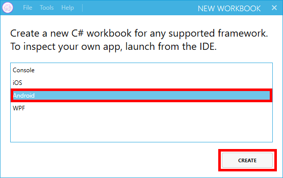

    _Creating a workbook for Android_

1. After a short delay, a blank Xamarin workbook will be created, and Xamarin Workbooks will launch your default Android emulator. Wait for the emulator to appear and display a default page.
 
	

    _A blank Xamarin workbook in the Android emulator_

1. A Xamarin workbook is composed of *cells*. There are two types of cells: executable cells and documentation cells. Executable cells contain C# code that can be executed inside the workbook. Documentation cells contain text that can be formatted using markdown syntax. You build interactive workbooks by creating sequences of executable cells and documentation cells.

	Return to Xamarin Workbooks and type the following line of code into the executable cell at the top of the workbook. Then press **Shift+Enter** to insert a blank line:

	```C#
	// This is an executable cell
	```

1. Enter the following line of code on the second line:

	```C#
	DateTime.Now;
	```

1. Click the **Run** button (or press **Ctrl+Enter**) to execute the code. 

	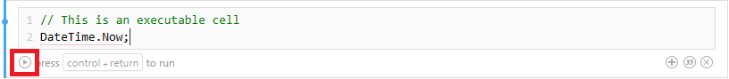

    _Running an executable cell_

1. Confirm that the result appears underneath the code. Use the drop-down under the **Default** button to try formatting the result in various ways.

	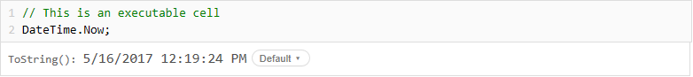

    _Results of executing a cell_

1. The three buttons in the lower-right corner of each cell allow you to add an executable cell, add a documentation cell, and delete the current cell, in that order. Click the third button in the cell that was added when you executed the code in the previous cell to delete it.

	

    _Deleting the newly added cell_

1. Click the middle button in the remaining cell to add a documentation cell.

	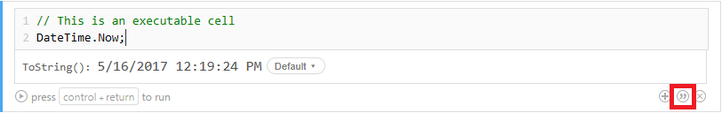

    _Adding a documentation cell_

1. Type "This is a documentation cell" into the documentation cell. Then highlight "documentation cell" and click the **Italics** button that appears above it.

	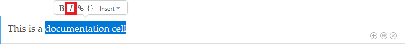

    _Italicizing text in a documentation cell_

1. Confirm that "documentation cell" is italicized. Then delete the documentation cell.

	

    _Adding a documentation cell_

Now that you're familiar with basic workbook concepts, including adding, deleting, and executing cells, let's build something more impactful.

<a name="Exercise2"></a>
## Exercise 2: Add documentation and live calculations to a Xamarin Workbook ##

Xamarin Workbooks are typically comprised of both document cells and executable cells, with markdown-style formatting applied for readability and structure. In this exercise you will be using the skills and familiarity gained in the previous exercise to create an interactive document providing the steps, descriptions, and calculations required to convert Earth time to Mars time.

1. Open Xamarin Workbooks to the blank document created earlier, if not already open from the previous exercise.
1. Click the **Add documentation cell** icon in the actions panel to add a new documentation cell.
1. Create a heading for your document by entering the following text in the new documentation cell:

	```Text
	What time is it on Mars?
	``` 
1. Format the value in the documentation cell by selecting **Format** > **Heading** > **Level 1** from the Xamarin Forms menu.

	

    _Formatting a value as a Level 1 Heading_
 
	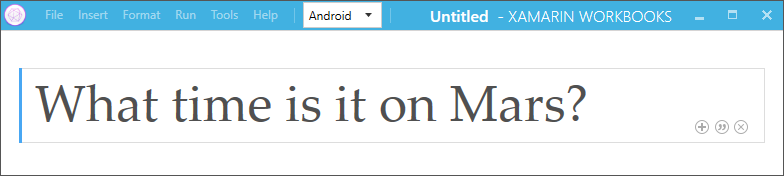

    _A formatted Level 1 Heading value_
 
1. Click the **Add documentation cell** icon in the actions panel to add another new documentation cell.
1. Copy and paste the following content into the cell to create a document introduction: 

	```TEXT
	This might seem like a crazy question, since you probably don’t have an appointment on Mars, but understanding the way the Mars calendar and cycles work makes it easy to figure out what “time” it is on Mars, based on the Earth concept of time and time spans. Now, you might be thinking this is just arbitrary question, but remember: so is Earth Time. In general, a bunch of people just strarted to agree that days would be based on solar cycles, and be divided into (about) 24 hours. To make it easy to understand Martian Time, using the familiar concept of Earth Time, we just need to perform a few calculations based on what a bunch of people agreed on, related to when and how Mars Time is dervied.

	Since the science community had to have a “starting point” for everything, they generally agreed to use what’s know as Epoch Time, or Unix Epoch Time, which is always  midnight January 1, 1970. Although you may not have realized it, midnight is not the end, but the start point for every day. Your starting point will be to figure out how many milliseconds have elaspsed since the Epoch.

	To make sure our calculations can use both C# and Xamarin Forms, you need to include a few lines of code like this:

	```
	At this point you're ready to start adding some code, and since you will be working with a Xamarin Forms for the remainder of this exercise, you need to add the Xamarin.Forms package to your workbook:

1. Click the **Add executable cell** icon in the actions panel to add a new code cell.
1. Select **File** > **Add Package...** from the Xamarin Workbooks menu, and enter "Xamarin.Forms" in the "Search NuGet" entry.
1. Select the latest **Xamarin.Forms** package and click **Add Package**.

	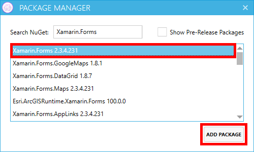

    _Adding the Xamarin.Forms NuGet package to a workbook_
 
1. Notice that Xamarin Workbooks added the package to your workbook, as well as adding required code to the code cell required to reference Xamarin Forms platform:

	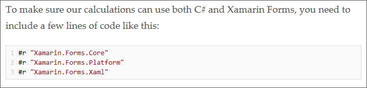

    _Automatically added references for Xamarin Forms assemblies_
 
1. Click the **Add executable cell** icon in the actions panel to add a new code cell, then insert the following ```using``` statement into the cell:
 
	```C#
	using Xamarin.Forms;
	```
1. Complete your first documentation section by clicking the **Add documentation cell**  section by and inserting the following content:

	```Text
	With that in place, you can start writing some code to calculate Martian Time, starting with the number of milliseconds since the epoch.

	Milliseconds Since the Epoch

	To calculate the number of milliseconds since midnight on January 1, 1970, in Universal Time:
	```
1. Highlight "Milliseconds Since the Epoch" in the documentation cell, then select **Format** > **Heading** > **Level 2** to format the content as a subheading:
1. Insert a new **executable cell** (code cell) and enter the following code, then click **Run**, or press CTRL + RETURN on your keyboard to execute the code.

	```C#
	DateTime value = DateTime.UtcNow;
	DateTime earthEpochDate = new System.DateTime(1970, 1, 1);
	double elapsedMilliseconds = (value - earthEpochDate).TotalMilliseconds;
	```
1. Observe the conversion of the current date and time to an ```elapsedMilliseconds``` variable value displayed in the editor: 

	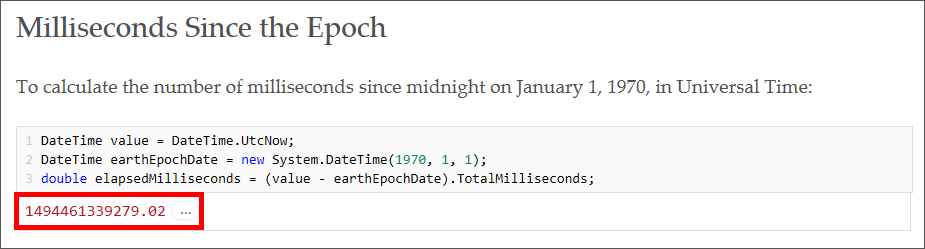

    _Executing the milliseconds since epoch code_
 
1. Add a new **documentation cell** and insert the following content:

	```Text
	Julian Date (UT)

	Next you need to get the number of days (rather than milliseconds) since a much older epoch than Unix time.

	To make this simple, and convert from the Gregorian date to the Julian date, by dividing milliseconds by 86,400,000 to get the number of days since the Unix epoch then you add that number to 2,440,587.5, which would be the exact Julian Date as of the Epoch.

	```
1. Highlight "Julian Date (UT)" in the documentation cell, then select **Format** > **Heading** > **Level 2** to format the content as a subheading:
1. Insert a new **executable cell** and enter the following single line of code, then click **Run** (or CTRL + RETURN), to  execute the code and observe the result of ```epochJulianDate```.

	```C#
	double epochJulianDate = 2440587.5 + (elapsedMilliseconds / (8.64 * Math.Pow(10, 7)));
	```
1. Add a new **documentation cell** and insert the following content:

	```Text
	Julian Date

	Now that you have the Julian Date, you actually need the Terrestrial Time (TT) Julian Date rather than the UTC-based one, meaning you basically just add the leap seconds which, since January 1, 2017, are 37 + 32.184.
	```
1. Highlight "Julian Date" in the documentation cell, then select **Format** > **Heading** > **Level 2** to format the content as a subheading.
1. Insert a new **executable cell** and enter the following single line of code, then click **Run** to  execute the code and observe the result of ```terrestrialJulianDate```.

	```C#
	double terrestrialJulianDate = epochJulianDate + (37 + 32.184) / 86400;
	```

1. Add a new **documentation cell** and insert the following content:

	```Text
	Days Since J2000 Epoch

	This is the number we're going to use as the input to many of our Mars calculations. It's the number of (fractional) days since midnight on January 1, 1970 in Terrestrial Time. We know what JDₜₜ was at the J2000 epoch (2,451,545.0) so it's a piece of cake to convert.
	```
1. Highlight "Days Since J2000 Epoch" in the documentation cell, then select **Format** > **Heading** > **Level 2** to format the content as a subheading.
1. Insert a new **executable cell** and enter the following single line of code, then click **Run** to  execute the code and observe the result of ```martianEpochDifference```.

	```C#
	double martianEpochDifference = terrestrialJulianDate - 2451545.0;
	```

	

    _Executing code to view the number of days in the J2000 epoch_
 
	With the number of days since the J2000 epoch calculated, there are just a few more steps to converting Earth time to Mars time.

1. Add a new **documentation cell** and insert the following content:

	```Text
	Mars Sol Date

	The equivalent of the Julian Date for Mars is the Mars Sol Date. At midnight on the 6th January 2000 (Δt J2000 = 4.5) it was midnight at the Martian prime meridian, so our starting point for Mars Sol Date is ΔJ2000 - 4.5.

	The length of a Martian day and Earth (Julian) day differ by a ratio of 1.027491252 so we divide by that. By  convention, to keep the MSD positive going back to midday December 29th 1873, we add 44,796.

	There is a slight adjustment as the midnights weren't perfectly aligned, so the NASA Mars24 site gives us an adjustment of - 0.00096.
	```
1. Highlight "Mars Sol Date" in the documentation cell, then select **Format** > **Heading** > **Level 2** to format the content as a subheading.
1. Insert a new **executable cell** and enter the following single line of code, then click **Run** to  execute the code and observe the result of ```martianSolDate```.

	```C#
	double martianSolDate = (((martianEpochDifference - 4.5) / 1.027491252) + 44796.0 - 0.00096);
	```
1. Add a new **documentation cell** and insert the following content:

	```Text
	Coordinated Mars Time

	Coordinated Mars Time (or MTC) is like UTC but for Mars. Because it is just a mean time, you can  calculated it based on the Mars Sol Date like this:

	There you have it! A some quick calculations to convert Earth Time to Martian Time! Now you can easily add some Xamarin Form controls to a page to display these calculations:
	```
1. Highlight "Coordinated Mars Time" in the documentation cell, then select **Format** > **Heading** > **Level 2** to format the content as a subheading.
1. Insert a new **executable cell** and enter the following single line of code, then click **Run** to  execute the code and observe the result of ```mct``` or "Mars Coordinated Time."

	```C#
	var mct = System.TimeSpan.FromHours((martianSolDate % 1) * 24);
	```

	

    _Executing code to view "Mars Coordinated Time"_
 
	That's a lot of "rocket science, but you're finally getting close. In fact Mars Coordinated Time is actually human-readable now, and looks pretty much like time on Earth. To get you the rest of the way you can add a step to make it perfect for Earth people:

1. Add a new **documentation cell** and insert the following content:

	```Text
	You can even clean it up a bit to make it more readable for people used to seeing Earth Time:
	```
1. Insert a new **executable cell** and enter the following single line of code, then click **Run** to  execute the code and observe the Mars Coordinated Time in an "Earth-friendly" format:

	```C#
	mct.ToString("hh\\:mm\\:ss");
	```
1. Add a new **documentation cell** and insert the following content:

	```Text
	And better yet, write a couple of quick DateTime extension methods to make it easier to convert:
	```
1. Insert a new **executable cell** and enter the following code:

	```C#
	static double ToMartianSolDate(this DateTime value)
	{
	    DateTime earthEpochDate = new System.DateTime(1970, 1, 1);
	    double elapsedMilliseconds = (value - earthEpochDate).TotalMilliseconds;
	    double epochJulianDate = 2440587.5 + (elapsedMilliseconds / (8.64 * Math.Pow(10, 7)));
	    double terrestrialJulianDate = epochJulianDate + (37 + 32.184) / 86400;
	    double martianEpochDifference = terrestrialJulianDate - 2451545.0;
	    double martianSolDate = (((martianEpochDifference - 4.5) / 1.027491252) + 44796.0 - 0.00096);
	
	    return martianSolDate;
	}
	
	static TimeSpan ToMartianTime(this DateTime value)
	{   
	    return System.TimeSpan.FromHours((value.ToMartianSolDate() % 1) * 24);
	}
	```
	>Xamarin Workbooks support almost everything you could do in a real app, including the creation of static extension methods. These extension methods will come in handy when you start adding code to interact with the Android emulator in the next exercise.

That might seem like a lot of code, but it's mostly just documentation. Remember, Xamarin Workbooks are designed to be interactive, instructional documents, and since the concept of converting Earth to Mars time is typically beyond the average developer, your new Xamarin Workbooks document is an ideal way to teach both concepts and coding without requiring a learner to flip back and forth between a document and an IDE.

You also probably noticed you haven't written any code to interact with the Android emulator yet. With all the documentation and code in place in your workbook, you're ready to start using these calculations to display your Earth to Mars time converter in a Xamarin Forms app in the next exercise.

<a name="Exercise3"></a>
## Exercise 3: Inspect code using the Xamarin UI Inspector ##

Xamarin Workbooks are not only interactive in the editor, but can also communicate with external processes, like a console window, WPF app, and iOS and Android emulator. Since an emulator gets started when a Xamarin Workbook is created, you only need to write a few lines of code to interact with it. Interaction with the emulator can come in various forms, such as creating UI controls to display on a page, as well as inspecting and adjusting control properties in the Xamarin UI Inspector.

In this exercise you will be adding documentation and code to your workbook to display an Earth to Mars time converter in the emulator, as well as inspecting and adjusting properties using the Xamarin UI Inspector built into Xamarin Workbooks.

1. Open Xamarin Workbooks to the document created earlier, if not already open from the previous exercises.
1. Scroll to the bottom of the document, add a new **documentation cell** and insert the following content: 

	```Text
	Now with all the “rocket science” code written, we can easily display these values in a Xamarin Forms app. Let’s start with showing the currert Earth Time, by adding a StackLayout and Label to a Xamarin Forms Content Page:
	```
1. Insert a new **executable cell** and enter the following code to create a Xamarin Forms ```StackLayout``` control and populate the control with additional controls for displaying calculations created earlier in your workbook:
 
	```C#
	var page = Xamarin.Forms.Application.Current.MainPage as ContentPage;
	var layout = new StackLayout() { Margin = new Thickness(40) };
	var earthlabel = new Label() { Text = "Earth Time:", FontSize = 32 };
	var earthTimeLabel = new Label() { Text = DateTime.Now.ToString("hh:mm:ss tt"), FontSize = 32 };
	
	layout.Children.Add(earthlabel);
	layout.Children.Add(earthTimeLabel);
	
	var marslabel = new Label() { Text = "Martian Time:", FontSize = 32 };
	var marsTimeLabel = new Label() { Text = earthEpochDate.Add(mct).ToString("hh:mm:ss tt"), FontSize = 32 };
	
	layout.Children.Add(marslabel);
	layout.Children.Add(marsTimeLabel);
	
	page.Content = layout;
	```
1. Observe the use of ```Xamarin.Forms.Application.Current.MainPage as ContentPage``` in the first line of code to instantiate the ```page``` variable. By using **Xamarin.Forms.Application.Current.MainPage** you can "talk to" the page displayed by Xamarin Workbooks in the emulator.
1. Click **Run** to  execute the code and observe the result of ```Xamarin.Forms.StackLayout``` in the code editor.

	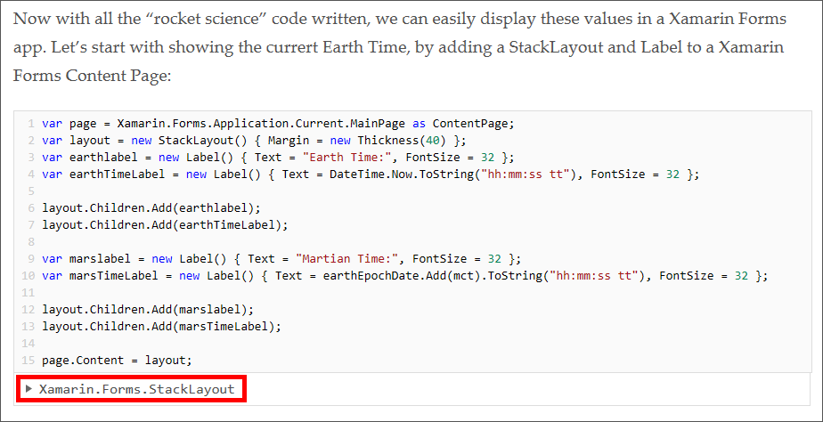

    _Executing code to create Xamarin Forms controls dynamically_
 
1. Return to the Android emulator that was started when you created your workbook, and notice all your calculations have come together perfectly, and populated controls on the page to display values:

	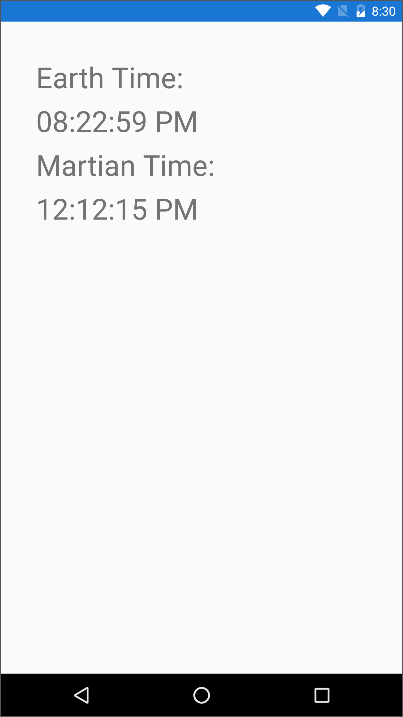

    _Viewing Earth to Mars conversion in the Android emulator_
 
	You have to admit that was pretty easy, and pretty cool, however in order to get real-time, up-to-the-second conversions you would have to execute the code in your workbook constantly. You can make it easier by adding a few lines of code to perform constant updates in the app just by adding a bit more documentation and code.

1. Insert a new **documentation cell** and insert the following content: 	
	
	```Text
	Better yet, you can even make your Martian Time Calculator realtime, but taking advantage of the Xamarin Forms platform device timer, like this:
	```
1. Insert a new **executable cell** and enter the following code to leverage the Xamarin Forms ```Device.StartTimer``` to update your calculations and display every second:

	```C#
	Device.StartTimer(TimeSpan.FromSeconds(1), () =>
	{
	    //YOUR LOCAL EARTH TIME
	    earthTimeLabel.Text = DateTime.Now.ToString("hh:mm:ss tt");
	
	    //EARTH UTC TO MARTIAN TIME
	    marsTimeLabel.Text = earthEpochDate.Add(DateTime.UtcNow.ToMartianTime()).ToString("hh:mm:ss tt");
	    return true;
	});
	```

	```Text
	Now, next time someone asks you “What time is it on Mars?” not only will you know, but you can show them how to calculate it themselves…just in case you’re stuck in traffic in the Asteroid Belt.
	```
1. Insert one final **documentation cell** and insert the following content to finish out your documenation: 

	Now that your Earth to Mars time conversion process is well documented and running well in the emulator, you may want to adjust the look and feel of the display without making permanent changes to your code. This is where the Xamarin UI Inspector comes in handy.

1. Still in your document in Xamarin Workbooks, select the **View Inspector** tab at the bottom left corner of the IDE.

	

    _Selecting the Xamarin UI Inspector tab_
 
1. Change the inspector platform to **Xamarin.Forms** to view the document explorer in Xamarin Forms control semantics. 

	

    _Changing the inspector platform to Xamarin.Forms_
 
1. Adjust both **Xamarin Workbooks** and the **Android emulator** to view viewed side-by-side on your desktop.

	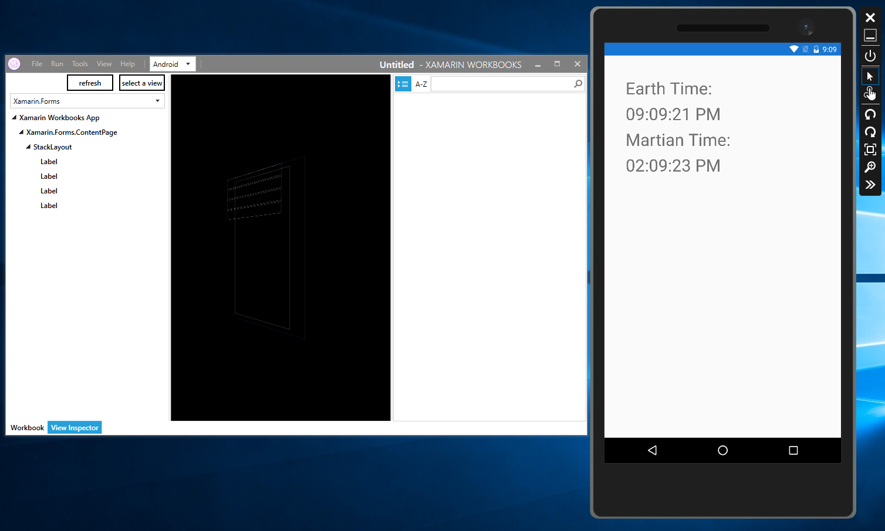

    _Viewing the inspector and emulator side-by-side_
 
1. In the UI Inspector, click **select a view** and then select the **Earth Time** Label in the emulator to set the ```Label``` as the selected view. 

	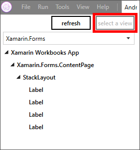

    _The select a view option in the inspector_

1. Locate the **TextColor** property in the inspector properties "Text" panel and change the **R** value to "217" and the **A** (alpha transparency) property to **100%** to change the foreground color to red and observe the immediate updates in the emulator.

	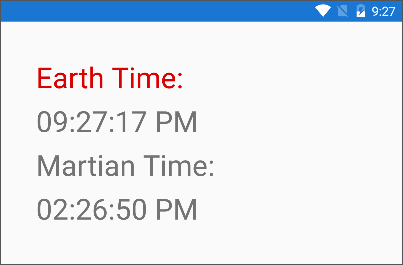

    _Changing the Earth Time label foreground color_ 

1. Repeat this process for the remaining three (3) labels to change the foreground color of the display to red.

1. Once last time, click **select a view** and then immediately select **any open area around the outer edge** of the page in the emulator to set the ```ContentPage``` as the selected view.
1. Locate the **BackgroundColor** property in the inspector properties "Visual Element" panel and make sure the **R**, **G**, and **B** values are set to "0" and then change the **A** (alpha transparency) property to **100%** to change the page background color to black.

	

    _Changing the Background color of the ContentPage in the inspector_ 

1. Observe the final. more "Mars-like" UI updates in the emulator.

	

    _The updated UI using the inspector_ 

1. To update the inspector UI view with recent changes, click **Refresh** and observe the updates in a three-dimensional view. Additionally, you can use your mouse to drag the view palette to find an alignment that works best for you.	

	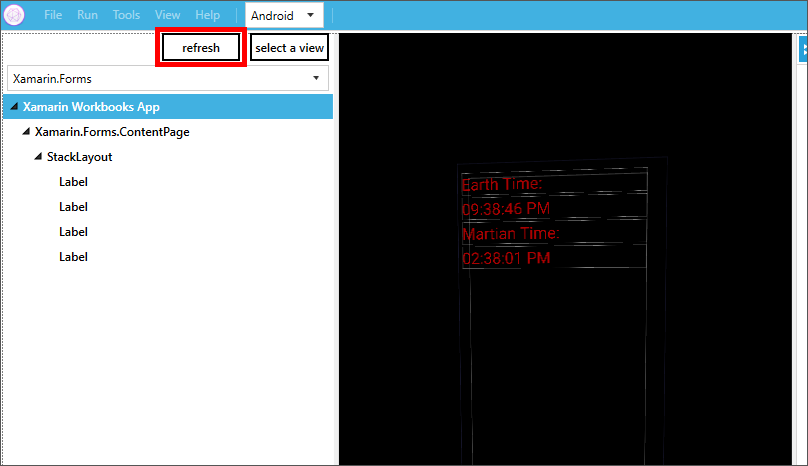

    _Refreshing the inspector UI view with recent changes_ 

Sending Xamarin Workbooks content directly to an emulator, and then tweaking the UI elements, is a great way to get familiar with the code and structure of an app, as well as create a quick prototype or proof-of-concept. Although not all properties can be manipulated directly from the inspector, a large number of properties are available for experimentation, including ```Scale``` and ```Rotation```.

More importantly, you now have a comprehensive, interactive document to serve as a learning tool you can distribute to your peers, colleagues, and friends, who can then simply open your creation in Xamarin Workbooks and learn how to convert Earth time to Mars time, in a simple and interactive way, without writing a single line of code.

<a name="Exercise4"></a>
## Exercise 4: Use the XAML Previewer for Xamarin.Forms to view UI updates ##

Creating a great mobile app experience is easy with Xamarin Forms, and creating a great UI is even easier. Using MVVM patterns and data binding concepts results in a clean design and separation logic, however working directly in the XAML code window often prevents you from seeing the impact of your changes until after you deploy your updates to an emulator or device. The XAML Previewer for Xamarin.Forms is designed to address this challenge by rendering page content and controls in an integrated window within the Visual Studio IDE.

In this exercise you will be setting up your Visual Studio 2107 environment to use and experiment with the XAML Previewer for Xamarin.Forms to view and adjust UI elements in your Drone Lander app.

1. In Visual Studio 2017, open the **DroneLander** solution created in the previous lab.
1. Open **MainPage.xaml** in the **DroneLander (Portable)** project to view the XAML code window.

	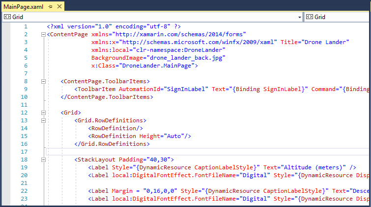

    _The MainPage.xaml XAML code window in the DroneLander (Portable) project_ 

1. Use the **View** > **Other Windows** > **Xamarin.Forms Previewer** menu in Visual Studio to open the preview window. 
1. Use the **Window** > **New Vertical Tab Group** menu to position it side-by-side with MainPage.xaml.

	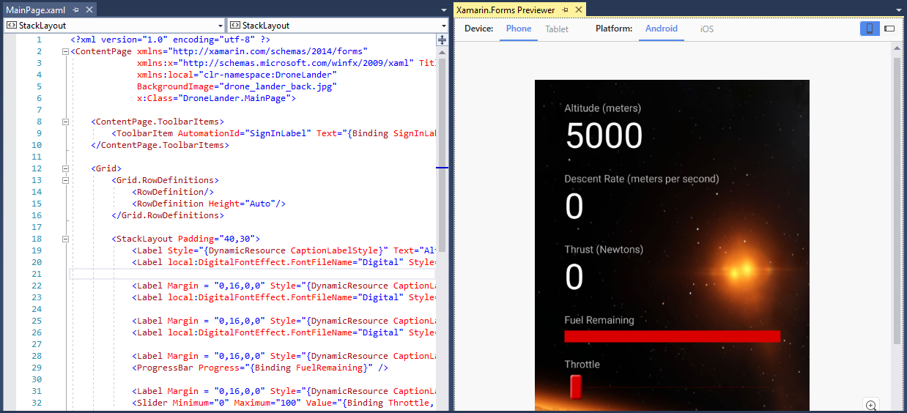

    _Showing the Xamarin.Forms Previewer side-by-side with a XAML code editor window_ 

1. Observe how many (but not all) user interface elements are rendered based on the XAML contained in MainPage.xaml, and also reflect runtime code changes, like implementation of both the ```FuelControlRenderer``` and ```ThrottleControlRenderer``` and the ```ActionLabel``` binding on the Start button.

	>Although most controls in the Xamarin.Forms Previewer render perfectly, some platform-specific code, such as the assignment of a custom font effect for Android, are not able to be seen until runtime.

1. As an experiment, using the MainPage.xaml **XAML code editor**, change the case of both the **Altitude** and **Descent Rate** labels to upper case to see live, real-time changes in the Xamarin.Forms Previewer window.

	

    _The result of temporarily changing labels to upper case as displayed in the Xamarin.Forms Previewer_ 

	The Xamarin.Forms Previewer supports both Android and iOS devices, as well as generic phone and tablet form factors. Viewing a rendered version in any orientation for these devices is simple.

1. In the **Xamarin.Forms Previewer window**, select **Tablet** as the "Device" then click the **landscape mode icon** in the upper right corner of the window to view MainPage.xaml rendered in landscape mode on a tablet form factor.

	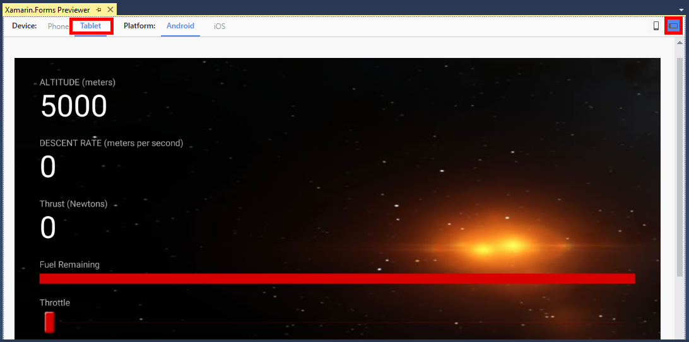

    _Viewing MainPage.xaml on a tablet form factor in landscape mode_ 

	>If you prefer the look of your labels in upper case, feel free to change the remaining controls to match, otherwise you can undo your changes in the XAML code editor.

Using the XAML Previewer for Xamarin.Forms can make quick work of user interface control and layout updates, to ensure you get your layout and design just right before running your app on a device or emulator.

In the next exercise you will be switching gears a bit to get familiar with another great Xamarin Forms tool, the Xamarin Profiler.

<a name="Exercise5"></a>
## Exercise 5: Diagnose potential performance issues with Xamarin Profiler ##

**If you do not have Visual Studio Enterprise 2017, you will not be able to perform all the steps in this exercise. Xamarin Profiler IDE integration is available in all release versions of Xamarin, however, [Visual Studio Enterprise](https://www.xamarin.com/compare-visual-studio "Visual Studio Enterprise") is required for profiling. If you are using Visual Studio Community or Professional 2017 you can review this lab and use it as a reference for later.**

More often than not, the success of a mobile app depends on the end user experience. As a developer you might have implemented some really awesome features in your app, but if the app is sluggish or prone to crashes, most users will uninstall it.
 
To proactively address this challenge, the Xamarin Profiler provides a large of profiling "instruments" such as Allocations, Cycles, and Time Profiler to measure and analyze app performance.

In this exercise you will use and experiment with the Xamarin Profiler to view and identify potential performance issue in your Drone Lander app.

1. In Visual Studio 2017, open the **DroneLander** solution created in the previous lab, if not already open from the previous exercise.
1. Use the **Tools** > **Xamarin Profiler** menu in Visual Studio to compile your project in debug mode and start the Xamarin Profiler.
1. Select **Performance** as the instrument "target" and click **Choose** to run the app and start a profiling session.

	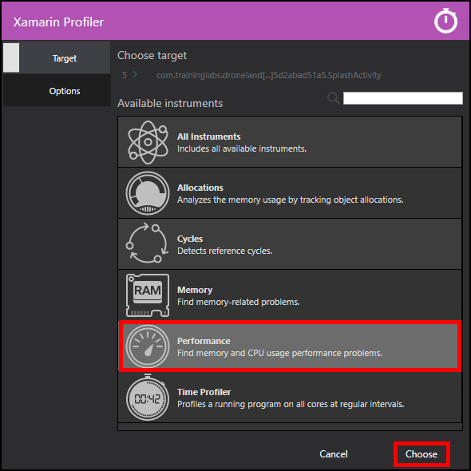

    _Choosing the Performance target in Xamarin Profiler_ 

1. In the Xamarin Profiler window, change the "Group by" filter to **Assembly** and observe the top memory allocations related to app performance.

	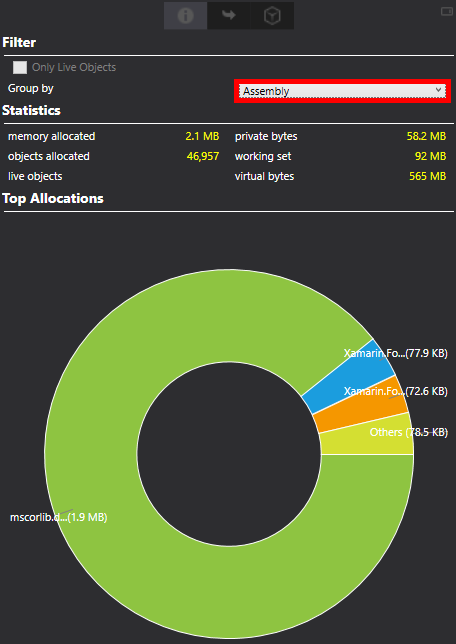

    _Filtering memory allocations by assembly_ 

1. Switch to **Drone Lander app** running in the emulator and start a landing attempt, then immediately switch back to the **Xamarin Profiler** and observe the changes to memory allocation based on assembly, such as the gradual increase in memory use for **Xamarin.Forms.Core.dll**. 

	

    _Observing the gradual increase in memory allocation in Xamarin.Forms.Core.dll_ 

	Although gradual memory increase in a specific assembly may not be an immediate problem, over time these resources will need to be disposed or device resource constraints could cause unexpected behavior or even a crash. The gradual increase of memory use by Xamarin.Forms.Core.dll indicated a possible opportunity to optimize code or processes.

1. Experiment with viewing profile instrumentation information in other ways, such as selecting the **Call tree** tab and then expanding individual symbols to get a more granular view of resource allocations.

	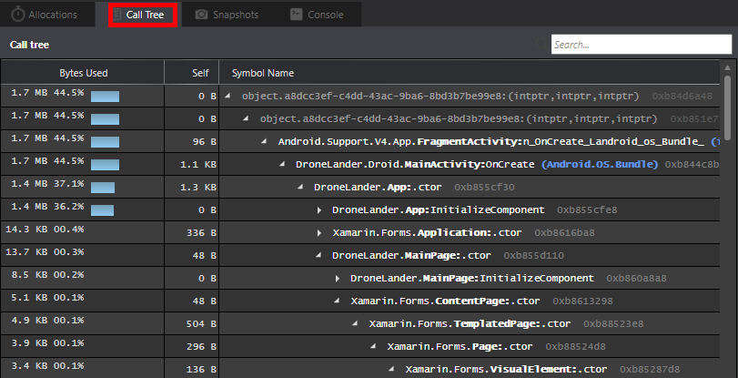

    _Observing and expanding the Call tree in Xamarin Profiler_ 

1. Click the **Stop profiling** button in the Xamarin Profiler IDE toolbar to end your profiling session.

	

    _Ending a profiling session in Xamarin Profiler_ 

This was just a quick example of using the Xamarin Profiler to diagnose potential performance issues in an app. The Xamarin Profiler is a powerful, comprehensive performance diagnostic tool in your mobile development toolkit. 

In this exercise you experimented with viewing and diagnosing performance issues based on memory allocations. Other helpful areas to experiment with are the Time Profiler, which measures exactly how much time is spent in each method of an application and Cycles, which can easily track references to objects that are not properly disposed.

<a name="Summary"></a>
## Summary ##

With Xamarin Workbooks you have a powerful documentation tool to provide rich, interactive documentation to colleagues and peers without the need for a creating projects, or even installing a development IDE. Combining the UI Inspector, XAML Previewer for Xamarin.Forms, and the Xamarin Profiler rounds out this toolkit to make sure you have everything you need, as a mobile app developer, to create polished, performant, scalable, and useful mobile apps with the Xamarin platform.

That's it for Part 5 of Operation Remote Resupply. In Part 6, you will be bringing it all together by building on the Mobile Center concepts from Part 3 to integrate testing into your app lifecycle, as well as leveraging the power of Xamarin UI Tests and Xamarin Test Cloud to create and execute automated testing scenarios that validate the functionality your mobile app.