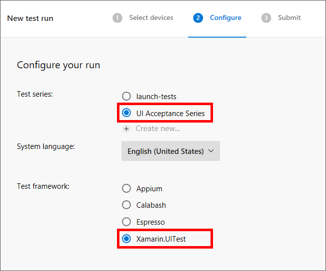

<a name="HOLTitle"></a>
# Operation Remote Resupply, Part 6 #

---

<a name="Overview"></a>
## Overview ##

In Part 4 of Operation Remote Resupply, you integrated both the build and distribute process of your development cycle with [Visual Studio Mobile Center](https://www.visualstudio.com/vs/mobile-center/ "Visual Studio Mobile Center") to create a seamless, automated process for building and distributing apps, triggered by commits to a source-code repository. Although a simple "load test" was performed during this process, true, automated UI acceptance testing is not yet currently part of the lifecycle.

Although there are many types of tests that could, and should, be performed before your app is distributed to real users, such as unit, component, and integration testing, UI acceptance testing is a critical component of creating a well-testing and polished user experience, and is typically at the "top of the testing pyramid" providing incredible value to the overall understanding of how your app behaves and performs.   

[Xamarin.UITest](https://developer.xamarin.com/guides/testcloud/uitest/ "Xamarin.UITest") is an automation library and testing framework, designed specifically to meet these needs, based on the open source [Calabash](http://calaba.sh/ "Calabash") initiative and leveraging the power of the [NUnit](http://www.nunit.org/ "NUnit") testing framework. Xamarin.UITest enables both scripted and recorded UI acceptance tests to be created and run against iOS and Android devices. Xamarin.UITest can also be tightly integrated with Xamarin.Forms, Xamarin.iOS, and Xamarin.Android projects, and used with iOS and Android projects written in other languages, such as Objective-C/Swift and Java. 

In this lab, you will use Xamarin.UITest to add scripted and recorded UI acceptance tests to the Android version of the Drone Lander solution, as well as integrate automated UI acceptance tests into your existing Visual Studio Mobile Center Build and Distribute lifecycle configured in an earlier lab.   

<a name="Objectives"></a>
### Objectives ###

In this lab, you will learn how to:

- Add a Xamarin UI Test project to a Xamarin Forms solution
- Write cross-platform UI acceptance test scripts
- Use the Xamarin Test Recorder to record scripts 
- Integrate automated UI tests with Visual Studio Mobile Center

<a name="Prerequisites"></a>
### Prerequisites ###

The following are required to complete this lab:

- [Visual Studio Community 2017](https://www.visualstudio.com/vs/) or higher
- A computer running Windows 10 that supports hardware emulation using Hyper-V. For more information, and for a list of requirements, see https://msdn.microsoft.com/en-us/library/mt228280.aspx. 

If you wish to build and run the iOS version of the app, you also have to have a Mac running OS X 10.11 or higher, and both the Mac and the PC running Visual Studio 2017 require further configuration. For details, see https://developer.xamarin.com/guides/ios/getting_started/installation/windows/.

>Although Xamarin iOS projects can be be configured for, and integrated with, Xamarin.UITest, it is not possible to run actual tests against iOS apps in Visual Studio or on Windows. Running tests against iOS requires both a Mac running OS X 10.11 or higher, and Visual Studio 2017 for Mac.

---

<a name="Exercises"></a>
## Exercises ##

This lab includes the following exercises:

- [Exercise 1: Add a UI test project to a Xamarin Forms solution](#Exercise1)
- [Exercise 2: Write cross-platform UI test scripts](#Exercise2)
- [Exercise 3: Use the Xamarin Test Recorder to record tests](#Exercise3)
- [Exercise 4: Integrate automated UI tests with Visual Studio Mobile Center](#Exercise4)
  
Estimated time to complete this lab: **45** minutes.

<a name="Exercise1"></a>
## Exercise 1: Add a UI test project to a Xamarin Forms solution ##
 
Although testing can be integrated into your development lifecycle at any time, the best time get started with testing, including UI testing, is during the development phase of a mobile app. Automated tests are typically "iterative" meaning they are often written as app features are being developed, and then adjusted and enhanced over the life of an app.

A Xamarin.UITest project can easily be added to an existing solution, and then a few simple steps taken to ensure your Android and iOS project are integrated into the testing process.

In this exercise you will add a Xamarin.UITest project to the **DroneLander** solution you have been developing, as well as confirming configuration and readiness for running UI tests. 

1. Open the DroneLander solution in Visual Studio 2017.

1. In Solution Explorer, right-click the solution and use the **Add** > **New Project** command to add a **UI Test App (Xamarin.UITest | Cross-Platform)** project named "DroneLander.UITest" to the solution. 
 
	

    _Adding a Xamarin.UITest project to the solution_

1. In Solution Explorer, right-click the **DroneLander.UITest** project and select **Manage NuGet Packages for Solution...**. Make sure "Installed" is selected. Then select **Xamarin.UITest** and click **Update** to install the latest stable version.

	

    _Updating Xamarin.UITest_

1. Repeat this process for the NUnitTestAdapter package, updating it to the latest stable version.

	> DO NOT update the NUnit package. Xamarin.UITest requires NUnit version 2.6 and does not work with version 3.0 and higher.

1. Right-click the **DroneLander.Android** project and select **Properties** from the context menu. Select **Android Manifest** and set **Package name** to "com.traininglabs.dronelander" if it isn't set to that already. Then save the modified manifest.

	

    _Setting the Android package name_

1. Notice the **AppInitializer.cs** and **Tests.cs** files that were created as part of the Xamarin.UITest project. **AppInitializer.cs** contains logic for configuring and activating platform-specific versions of your app, while **Tests.cs** is where you write your tests.

	Open **AppInitializer.cs** and add the following statement directly above the call to ```StartApp``` to connect the test project to the Android version of Drone Lander:

	```C#
	.InstalledApp("com.traininglabs.dronelander")
	```
	 
	

    _Specifying the app package name in the test project_

1. Rebuild the solution. Then open Test Explorer using Visual Studio's **Test** > **Windows** > **Test Explorer** command. Confirm that two tests named "AppLaunches" are displayed. The first is for Android, and the second is for iOS. These are tests that are performed each time the app launches.
	 
	

    _AppLaunches tests in Test Explorer_

1. Right-click the first AppLaunches test and select **Open Test** to view the code for the test in **Test.cs**. Note the ```[Test]``` attribute decorating the ```AppLaunches``` method. This attribute marks a method as a callable entry point for an NUnit test and exposes it to the Xamarin.UITest platform for execution. Other attributes such as ```[StartUp]``` and ```[TearDown]``` are also useful when working with Xamarin.UITest. 

1. When a Xamarin.UITest project is created, the default ```AppLaunches``` method contains a single call to the ```Screenshot``` method to take a screen shot of the app.

	

    _The Android AppLaunches method_

	By default, screen shots are not stored locally. To change that, go back to **AppInitializer.cs** and add the following statement after the call to ```InstalledApp``` that you added earlier:

	```C#
	.EnableLocalScreenshots()
	```
	
1. Right-click the first **AppLaunches** test in Text Explorer and select **Run Selected Tests** to run the AppLaunches test for the Android version of Drone Lander. Then wait until Test Explorer indicates that the test has completed successfully.

	

    _A successful test_

1. Screen shots that are saved locally are saved in the build folder in the test project. Right-click the test project and use the  **Open Folder in File Explorer** command to open a File Explorer window. Then navigate to the "bin\Debug" subdirectory and confirm that it contains a screen shot named **screenshot-1.png**.

	

    _The screen shot created during the test run_

You now have a UI test project integrated into your solution. The next step is to add test scripts to the project to do more than just snap a screen shot when the app launches.

<a name="Exercise2"></a>
## Exercise 2: Write cross-platform UI test scripts ##

Xamarin.UITest provides a rich API for implementing sophisticated UI tests. You can simulate button clicks, insert text into entry fields, change the orientation of the device (or emulator), and a whole lot more. In this exercise, you will add code to the Android AppLaunches test to perform simple actions using just a few of the APIs available in the Xamarin.UITest framework.

1. Open **Tests.cs** in the **DroneLander.UITest** project and replace the code in the ```AppLaunches``` method with the following code:

	```C#
	app.Tap(x => x.Button("Start"));
    app.Screenshot("The app in progress.");
	``` 

	The first line of code simulates a tap of the Start button by querying the UI for a button labeled "Start" and then passing it to the ```Tap``` method. The second line snaps a screen shot after the button is tapped — that is, once a descent has begun.

1. Right-click the first **AppLaunches** test in Test Explorer and select **Run Selected Tests** to run the updated test for the Android version of Drone Lander. Then switch to the Android emulator and watch as Drone Lander loads and the Start button is tapped to begin a descent.

	

    _A descent initiated by a test script_

1. In Drone Lander, tap **Reset** to end the descent.

1. Navigate back to the test project's "bin\Debug" folder and open **screenshot-1.png**. Confirm that it pictures the app *after* the Start button is tapped.

1. In addition to interacting with elements in the UI, Xamarin.UITest test scripts can interact with the device itself. To demonstrate, add the following statements to the ```AppLaunches``` method in **Test.cs** in the test project, immediately after the call to ```app.Screenshot```:

	```C#
    app.Flash(x => x.Text("Sign In"));
    app.SetOrientationLandscape();
    app.PressVolumeDown();
    app.PressVolumeDown();
    app.SetOrientationPortrait();
    app.Flash(x => x.Button("Reset"));
    app.PressVolumeUp();
    app.PressVolumeUp();
	```

1. Run the Android AppLaunches test again, and switch to the Android emulator to see the automated test in action. When you're done, click **Reset** to stop the descent.

	> Since these steps are automated, they happen quickly. If desired, you could insert calls to  ```Thread.Sleep``` to space them out more. 

You can create sophisticated tests by coding them manually as you did in this exercise. However, what if you could simply "record" your UI tests by interacting with the app and then play them back? With the Xamarin Test Recorder, you can do just that.

<a name="Exercise3"></a>
## Exercise 3: Use the Xamarin Test Recorder to record tests ##

Coding UI automation tests by hand is time-consuming and error-prone. The [Xamarin Test Recorder](https://developer.xamarin.com/guides/testcloud/testrecorder/) is a Visual Studio 2017 extension that can record your interactions with an app and create automated tests written in C# based on those interactions. In this exercise, you will install the Xamarin Test Recorder and record UI automation tests that can be run locally or integrated with the app lifecycle using the [Xamarin Test Cloud](https://www.xamarin.com/test-cloud) or Visual Studio Mobile Center.

> The Xamarin Test Recorder is only available in Visual Studio Enterprise 2017. If you are *not* using the Enterprise edition, simply read through this exercise as well as the next one to learn about the basics of using the recorder and integrating the resultant tests into the app lifecycle.

1. Install the Xamarin Test Recorder by using Visual Studio's **Tools** > **Extensions and Updates** command to display the "Extensions and Updates" dialog, searching for "xamarin test recorder" in the Visual Studio Marketplace, and clicking **Download**.

	

    _Installing the Xamarin Test Recorder_

1. Close Visual Studio 2017 to allow the Xamarin Test Recorder to install, and then reopen the DroneLander solution after installation is complete. 

1. Open **Tests.cs** in the **DroneLander.UITest** project and confirm that two record icons appear in the left margin. These icons are used to begin recording UI automation tests. The ```TextFixture``` attribute indicates that a class contains callable test methods. 

	

    _The Xamarin Test Recorder icons_

1. The Xamarin Test Recorder can't use the Mono Shared Runtime that is typically used in debug builds. Therefore, change the current build configuration to release mode. Then rebuild the **DroneLander.Android** project to produce a release build.

	

    _Changing the build configuration_

1. Click the record icon to the left of ```[TextFixture(Platform.Android)]``` in **Tests.cs** and select **Record New Test** > **Build DroneLander.Android project** to start a recording session.

	

    _Starting a recording session_

1. Wait until the Xamarin Test Recorder begins connecting to the emulator, as pictured below. Then launch the app in the Android emulator.
	
	

    _Connecting Xamarin Test Recorder to an emulator session_

1. **Wait for the connection status to change from "Connecting to app..." to "Connected".** This may take up to 30 seconds. Then switch to the emulator and perform the following steps in the order shown:

	- Tap **Sign In**
	- Enter the e-mail address for your Microsoft account
	- Tap the **Next** button
	- Enter the password for your Microsoft account
	- Tap the **Sign In** button
	- Tap **Activity** to view landing activity
	- Tap the emulator's back button
	- Tap **Start** to begin a descent
	- Slide the throttle slider all the way to the right
	- Tap **Reset** 
  
1. Return to Visual Studio 2017 and observe that a new method named ```NewTest``` has been created in **Tests.cs** and populated with lines of code corresponding to the actions you just performed. Click the icon to the left of the last line and select **Stop Recording**.

	> Steps related to signing in with your Microsoft account may not have been captured. If that's the case, don't fret; you will fix that in a moment. Capturing these actions often depends on the speed with which the dialogs load and other factors unrelated to Xamarin.UITest.

	

    _Ending the recording session_

1. In Test Explorer, right-click the Android version of **NewTest** and select **Run Selected Tests** to run the test in the emulator. Then switch to the Android emulator and observe the automated test in action.

	> You can easily determine whether a test method targets Android or iOS by hovering over the test in Test Explorer and inspecting the ensuing tooltip window.

1. When played back, the part of the test in which you sign in with your Microsoft account might not work, and it might even hang. This is because the recording doesn't take into account the time required for pages and dialogs to load. You can fix this by modifying the code generated by the Xamarin Test Recorder. Begin by changing the name of the ```NewTest``` method to something more descriptive such as "SignInAndCheckActivity."

1. If the generated test code generated **does not** include statements referencing the ```WebView``` class, insert the following statements after the first statement in the test method to automate the sign-in process. Substitute your user name and password for YOUR_MICROSOFT_ACCOUNT_EMAIL_ADDRESS and YOUR_MICROSOFT_ACCOUNT_PASSWORD.

	> In production testing scenarios, you will want to create test accounts to use in your tests and avoid using personal accounts.

	```C#
	app.WaitForElement(c => c.WebView().Css("INPUT#i0116"));
    app.EnterText(x => x.WebView().Css("INPUT#i0116"), "YOUR_MICROSOFT_ACCOUNT_EMAIL_ADDRESS");
    app.Tap(x => x.WebView().Css("INPUT#idSIButton9"));
    app.EnterText(x => x.WebView().Css("INPUT#i0118"), "YOUR_MICROSOFT_ACCOUNT_PASSWORD");
    app.Tap(x => x.WebView().Css("INPUT#idSIButton9"));
	```

1. If the generated test code **does** include references to the ```WebView``` class, insert the following statement after the first statement in the test method to wait for the authentication dialog to appear:

	```C#
	app.WaitForElement(c => c.WebView().Css("INPUT#i0116"));
	```

	The ```WaitForElement``` method provides an easy-to-use mechanism for delaying until a condition involving a UI element is satisfied. In this example, it waits for the authentication dialog to render in the ```WebView``` control.

1. Since the Test Recorder doesn't record or reproduce "delays" when recording, it's often helpful to force a delay in a script, or wait for a UI element to become available before moving to the next step. You may have noticed that the generated code immediately goes back to the previous page after navigating to the landing-activity page.

	To compensate, insert the following statement after the statement that simulates a tap of the Activity button to wait for the text string "Kaboom" to appear on the landing-activity page:

	```C#
	app.WaitForElement(x => x.Text("Kaboom"));
	```

1. Since your recording includes a tap of the Reset button following the increase in throttle, you should introduce a delay before Reset button is tapped to allow the landing simulation to run for a period of time. To that end, add the following statement after the statement that changes the value of the Slider control:

	```C#
	 System.Threading.Thread.Sleep(2000);
	```

1. Rebuild the **DroneLander.UITest** project so the new test methods appear in Test Explorer.

	

    _The updated test methods in Test Explorer_

1. Run the Android version of the test. Then switch to the Android emulator and watch the test execute. Confirm that the test executes successfully and that Text Explorer indicates that the test passed.  

	

    _A successful test_

Automating UI tests in this manner by using the Xamarin Test Recorder to record your actions and, when necessary, modifying the code that it generates reduces the amount of effort required to incorporate UI tests into the development process. The next step is to run the tests that you create on real hardware, and not just on hardware you own, but on a variety of devices. Only then can you be reasonably assured that your app is robust enough for real-world use.

<a name="Exercise4"></a>
## Exercise 4: Integrate automated UI tests with Visual Studio Mobile Center ##

It probably isn't realistic for you to collect hundreds of devices on which to run your tests. Even if you could, the process of running them one by one would be painstaking unless that process, too, were automated.

Both the [Xamarin Test Cloud](https://www.xamarin.com/test-cloud) and Visual Studio Mobile Center can solve this problem for you by enabling you to run the automated tests that you create on hundreds of devices. In this exercise, you will add the **DroneLander.UITest** project to the GitHub repo that you created earlier and integrate the automated tests into the app lifecycle using Visual Studio Mobile Center.

1. In Visual Studio 2017, open **Tests.cs** in the **DroneLander.UITest** project, and replace the code inside the **SignInAnCheckActivity** method with the following code:

	```C#
	app.Tap(x => x.Text("Start"));
    app.SetSliderValue(x => x.Class("FormsSeekBar"), 1000);
    System.Threading.Thread.Sleep(2000);
    app.Screenshot("Drone Lander in action");
    app.Tap(x => x.Text("Reset"));
	```
	>Since many third-party authentication services, including Microsoft accounts, often require two-factor authentication or secondary forms of sign in validation, you are removing code related to authentication to avoid any "false failures" during test runs, as well as adding the Screenshot method to capture the state of the UI during a landing attempt.
	
1. The SignInAnCheckActivity method now performs tasks associated with app launch, making the existing AppLaunches event no longer necessary. Still in **Tests.cs** remove the entire **AppLaunches** event, include the ```[Test]``` attribute.
	
	>Although you could technically leave the default AppLaunches event in place, the new SignInAnCheckActivity method performs start up and launch validation and make the AppLaunches event redundant.

1. Ensure you are still in **Release** mode configuration from the previous exercise, then right-click the **DroneLander.Android** project and use the **Archive...** command to create a Release version of the project package.
1. Still in Visual Studio, add your DroneLander.UITest project to your GitHub repo by clicking the GitHub **changes indicator** at the lower-right corner of the Visual Studio IDE status bar.

	

    _The Visual Studio GitHub changes indicator_

1. Enter a commit message such as "Added a new Xamarin.UITest project." then select **Commit All and Push** from the "Commit All" selector. 

	As you may recall from an earlier lab, your Drone Lander solution is integrated with GitHub, and any new commits will automatically trigger the Build and Distribute process. Xamarin.UITest is designed to seamlessly integrate into this process and function as the **Test** portion of a full Build, Test, Distribute lifecyle.

1. Open [Visual Studio Mobile Center app portal](https://mobile.azure.com/apps) in your browser and click the Android version of **Drone Lander** created in an earlier lab, then select the **Test** tab. 
 
	

    _Accessing the Test tab in Visual Studio Mobile Center_

	Although you may have activity from an earlier lab, the tests run during these sessions were simple "app launch" tests you designated as part of the Build and Distribute lifecycle. For real testing you will be integrating your Xamarin.UITest methods into the Build and Disribute process.

1. Click **Test Series** in the upper-left corner of the page to create a new test series definition, then click **Create new series**.

	

    _Accessing the Test tab in Visual Studio Mobile Center_

1. Enter "UI Acceptance Series" as the "New test series" name, then click **Create**. After a short delay your new test series will be created.

	

    _Accessing the Test tab in Visual Studio Mobile Center_

1. Close the dialog to be returned to the Mobile Center Test page, then click **New Test Run**.
1. On the "Select devices" step, select a single device, such as the "Google Pixel XL", then click **Select (1) device** at the bottom of the screen.

	

    _Selecting a target device for a new test run_

	>In real world testing you would like select a larger number of diverse devices for testing, however you should only select a single device for this step, as adding additional device requires additional processing time during acceptance test runs.

1. On the "Configure" tab, select **UI Acceptance Series** as the "Test series" and **Xamarin.UITest** as the "Test framework", then click **Next**.

	

    _Selecting a series and framework for testing_

1. Review the information on the final "Submit" step, observing the requirements to run specific command-line commands using the Mobile Center Command Line Interface (CLI) in the "Prerequities" panel. **Perform steps 1 and 2** to ensure you have both [Node.js](https://nodejs.org/en/ "Node.js") and the [Mobile Center CLI](https://docs.microsoft.com/en-us/mobile-center/cli/ "Mobile Center CLI") installed on your workstation.   

	

    _The Mobile Center automated test pre-requisites steps_

1. From the "Running tests" panel copy the Mobile Center CLI command and parameters by clicking **Copy to clipboard**.

	

    _Copying Mobile Center CLI command and parameters to the clipboard_

	These commands need to be run from the NuGet **packages** folder located in the root of **Drone Lander solution**. You can easily determine and navigate to this location in a command prompt window by using the Solution and File Explorer.

1. Open a command prompt and type in "cd " (as the change directory command), then right-click the **DroneLander** solution and use the **Open Folder in File Explorer** command to view the folder location on your file system.
1. Drag the **packages** folder **into the command window** to insert the full path to the packages folder, then press the **enter key** on your keyboard to change the working directory to the packages folder.
1. Paste the **contents of the clipboard** into the **command window**, being careful not to execute the command.
1. In the script, replace **pathToFile.apk** with the following command (**including** the quotation marks.) **This will be the location of your Android archive when you build it in Release mode.**

	```Text
	"..\DroneLander\DroneLander.Android\bin\Release\com.traininglabs.dronelander.apk"
	``` 
1. Replace **pathToUITestBuildDir** with the following command (again including quotation marks.) **This is the location of your Xamarin.UITest build directory.**

	```Text
	"..\DroneLander.UITest\bin\Release"
	```
1. Press the **enter key** on your keyboard to begin execution of the Mobile Center CLI commands.

	

    _Preparing and submitting acceptance tests via the Mobile Center CLI_

1. Return to the **Test** tab for the Android version of Drone Lander in the Mobile Center. After a short delay, the Mobile Center Test tab will start displaying the status of your acceptance test submission and run.

	

    _Test execution status in the Mobile Center during command-line execution_

1. Since Mobile Center is running your automated UI tests on a real device, this process **could take as long as 10 to 15 minutes to complete**. When the "Status" of the automated UI test run changes to "PASSED", select the list entry to view test run details.
1. Observe the correct timing of the screenshot (while a landing attempt is in progress) as well as the labeling of the screenshot as "Drone Lander in action."

	

    _A successful automated UI test in Visual Studio Mobile Center_

	For more detailed information about test runs on specific devices, you can click on Details and Logs to get complete device specifications, test log step details, and even full stack traces.

That's it, you did it! In this exercise you added automated UI acceptance testing to your Build and Distribute lifecycle in Visual Studio Mobile Center, automating your entire mobile app lifecycle in a few easy steps.

<a name="Summary"></a>
## Summary ##

That's it for Part 6 of Operation Remote Resupply. By combining the power of Xamarin.UITest, Test Recorder, and Visual Studio Mobile Center, your entire development lifecycle is now complete, and fully automated. The tests you created in this lab, although simple, can provide you with a solid foundation for creating more thorough, robust, and meaningful UI acceptance tests as you travel along on your mobile app development journey using the Xamarin platform and other tools in the Xamarin tool set.